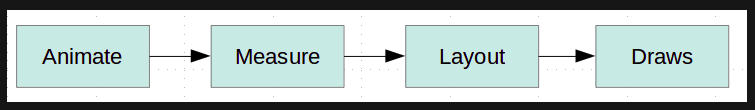
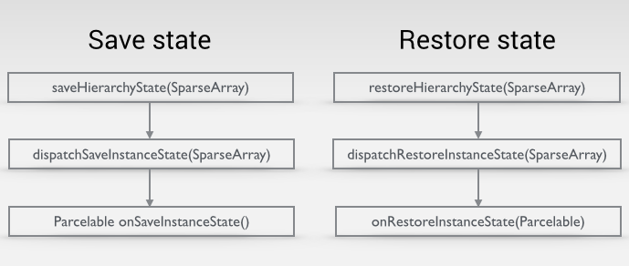

View
---
<p dir="rtl">
گاهی اوقات یک کاستوم‌ویو می‌خواهیم که مشابه آن در اندروید وجود نداشته و حتی با ابزارهای عادی اندروید نمی توانیم آن را بسازیم. در اینجا از کاستوم‌ویو استفاده می‌کنیم. در حالت دیگر زمانی از کاستوم ویو استفاده می‌کنیم که پرفورمنس ویو‌ها خیلی برای ما مهم باشد و داشتن هایراکی در ویو اثر مطلوبی نداشته باشد.
وقتی که یک ویو را فلت می زنیم(با کاستوم‌ویو مثل رو‌های لیست‌ویو تلگرام)، یعنی کاستوم‌ویو آن را می‌نویسیم، به پرفورمنس بهتری دست پیدا خواهیم کرد، چرا که هر با سایز همه زیرلایه‌های آن ویو حساب نمی‌شود(مثال در لیست‌ویو).
</p>

ویو در اندروید چیست؟
---
<p dir="rtl">
ویو یک کلاس در  پکیج android است که مستقیما از آبجکت ارث‌بری می‌کند.
</p>
<p dir="rtl">
این کلاس پایه اصلی همه ویجت‌های اصلی ui در اندروید است .
</p>
<p dir="rtl">
متد‌های drawblabla و . .. در این کلاس است.
</p>


چرخه‌حیات ویو چگونه است؟ و چطور کار می‌کنند؟ و چگونه با چرخه‌حیات ویو کار کنیم؟
---
<p dir="rtl">
چرخه  حیات ویو‌ها همانند عکس زیر است.
</p>



<p dir="rtl">
برای هر ویو این چرخه به ترتتیب اجرا می‌شود که باعث صدازده‌شدن، کال‌بک‌های زیر می‌شود.
</p>


<p dir="rtl">
محاسبه ویو‌ها در اندروید از زمانی شروع می‌شود که اکتیویتی فوکوس را بدست بگیرد، در این زمان از نود ریشه ویو‌ها(بالاترین ویو) شروع به محاسبه و ساخت ویو‌ها می‌کند.
ویو‌ها از بالا (نود ریشه) و به ترتیب اندازه‌گیری و ...  می‌شوند و هر ویوگروپ مسئول اندازه‌گیری بچه‌های خودش هست.
</p>

<p dir="rtl">
لایف‌سایکل ویو‌ها از کانستراکتور شروع می‌شود، زمانی که کانستراکتور ویو صدازده می‌شود، نمونه‌ای از آن ویو در مموری ساخته می‌شود(مثل هر آبجکت دیگری در جاوا)، سپس به ترتیب کال‌بک‌های موجود در لایف‌سایکل ویو صدا‌زده می‌شوند. 
ابتدا پرنت ویو موردنظر بعد از آنکه ویو  را با  addView  به خودش اضافه‌کرد، کال‌بک onAttachedToWindow()  را از childView صدا می‌زند. ر این زمان ویو مورد‌نظر به پدرش اضافه شده است.
</p>

<p dir="rtl">
بعد از آن Measure() و  onMeasure()  صدا زده‌می‌شوند که کارشان محاسبه سایز ویو موردنظر است، در این دو متد باید اندازه ویو مورد نظرمان را محاسبه کنیم.
</p>

<p dir="rtl">
بعد از آنکه سایز ویو محاسبه شد، نوبت به layout() و onLayout()  می‌رسد.
در layout و  onLayout  هر ویو پدر، مسئول جایگذاری و چینش تمام بچه‌های خودش با استفاده از سایز حساب‌شده در  Measure است. 
</p>

<p dir="rtl">
بعد از Layout  نوبت به رسم می‌سد که در کال‌بک  onDraw  و با استفاده از canvas هرچیزی که بخواهیم را رسم می‌کنیم.
</p>

<p dir="rtl">
اگر بخواهیم ویو دوباره رسم شود و سایز ویو هیچ تغییری نکرده باشد، از متد invalidate  استفاده می‌کنیم که دوباره onDraw و.... را صدا می‌زند و باعث می‌شود ویو دوباره رسم شود.
</p>

<p dir="rtl">
اما اگر سایز ویو تغییر کند باید متد requestLayout را صدا برنیم تا onMeasure  هم دوباره اجرا شده و سایز درست رسم شود.
</p>

<p dir="rtl">
توجه کنید که در  onDraw فقط باید رسم کنید و از انجام کارهای بزرگ و مثل ساخت آبجکت و .... خودداری کنید.
</p>


چگونه کاستوم‌ویو خوب بنویسیم؟
---

<p dir="rtl">
ایده خوبی پیدا کن، همه نکات طراحی را رعایت کن. 
</p>

زمانی که یک ویو hirarchy های نستد زیادی داشته باشد، چه تاثیری روی پرفورمنس آن دارد، این تاثیر برای چه اتفاق می‌افتد و چگونه می‌توان از آن جلوگیری کرد؟
---

<p dir="rtl">
زمانی که ویو‌ها hierarchy های زیادی داشته و خیلی nested ui داشته باشیم، محاسبه و جایگذاری لایه‌ها خیلی سخت می‌شود و این باعث کاهش پرفورمنس می‌شود. برای همین بهتر است از لایه‌های تخت مثل ConstraintLayout استفاده کنیم.
</p>

<p dir="rtl">
مثلا یکی از کارهایی که باعث ایجاد نستد اضافی می‌شود استفاده از include است، و برای حل این مشکل می‌توانیم از merge  استفاده کنیم.
</p>

<p dir="rtl">
برای آنکه مشکلات پرفورمنسی ویو‌ها را بفهمیم، یک سری ابزار وجود دارد، این ابزار ها در زیر لیست شده‌اند:
Systrace, Profile GPU rendering, Lint,Layout Inspector 
</p>


ساخت کاستوم‌ویو
---
<p dir="rtl">
زمانی که بخواهیم یک کاستوم‌ویو بسازیم، باید کلاسمان را از کلاس View اندروید اکستند کنیم.
در این حالت هم می‌توانیم از ویو‌های آماده اندروید(مثل TextView) استفاده کنیم و هم می توانیم از Canvas برای رسم ویو دلخواه خودمان استفاده کنیم.
</p>

<p dir="rtl">
زمانی که می‌خواهیم یک کاستوم‌ویو بسازیم، باید حتما دو کانستراکتور زیر را ایمپلمنت کنیم. کانستراکتور اول برای زمانی استفاده می‌شود که ویو را از داخل کلا جاوا بسازیم و کانستراکتور دوم زمانی استفاده می‌شود که از ویو را از داخل xml بسازیم.
</p>

<p dir="rtl">
اگر هر یک از کانستراکتور‌ها را ایمپلمنت نکنیم، هنگام استفاده از آن اپ کرش خواهد‌کرد.
</p>

<p dir="rtl">
لایف‌سایکل یک کاستوم‌ویو همانند شکل زیر است. 
</p>


<p dir="rtl"><p dir="rtl">
کال‌بک onDraw: در این کال‌بک یک نمونه از Canvas  بازگردانده می‌شود که با استفاده از این کلاس و کمک گرفتن از Paint می‌توانیم، هر چیزی را رسم کنیم.
</p>

<p dir="rtl">
برای رسم شکل توسط Canvas از متد‌های draw این کلاس ایتفاده می کنیم.
</p>

<p dir="rtl">
Canvas ابزاری برای رسم شکل‌های ماست درحالیکه Paint استایل و ویژگی‌های شکلی که می‌خواهیم رسم شود را تعیین می‌کند، Canvas از روی این ویژگی‌ها شکل را رسم می‌کند.
</p>

<p dir="rtl">
بررسی برخی از فانکشن‌های Canvas:
</p>

<p dir="rtl">
drawLine:
 با این فانکشن می‌توانیم خط مستقیم رسم کنیم. که مختصات نقطه شروع و پایان و Paint  مربوط را گرفته و از روی آن خط را رسم می‌کند.
</p>
<p dir="rtl">
drawCircle: 
با استفاده از این متد دایره می‌کشیم. که مختصات نقطه مرکز، شعاع دایره و Paint را گرفته و رسم می‌کند.
</p>

<p dir="rtl">
انواع Style ها در  Paint: 
سه نوع استایل در پینت وجود دارد: ۱-استروک که فقط استروک می‌کشد. ۲-فیل که فقط وسط شکل را می‌کشد و ۳-استروک‌اندفیل که هم وسط و هم استروک را می‌کشد.
</p>

<p dir="rtl">
drawRect: 
متدی است که یک rect و یک paint می گیرد و آن را رسم می‌کند. رکت هم آبجکتی است که دو نقطه مختصات شروع و پایان مستطیل را می‌گیرد.
</p>

<p dir="rtl">
drawArc:
با این متد می‌توانیم نیم‌دایره و یا قسمتی از دایره را رسم کنیم.
این متد یک رکت می‌گیرد و یک startAngel که زاویه شروع رسم است و sweepAngel هم مقدار زاویه‌ای است که می‌خواهیم شکل ادامه پیدا کند و بعد از آن useCenter است که بولینی است که مشخص می‌کند آیا از شکل به مرکز آن خط رسم‌ شود یا خیر. و در انتها هم پینت را می‌گیرد.
</p>

<p dir="rtl">
drawText:
این متد با گرفتن استرینگ تکست و مختصات رسم و پینت، متنی را برای ما رسم می‌کند.
</p>

<p dir="rtl">
نکته: با استفاده از مقدار بازگشتی متد getTextBoundsای که در paint وجود دارد، می‌توانیم بفهمیم که متنی که رسم می‌کنیم، چه مختصاتی از صفحه را می‌گیرد. خود این تابع خروجی‌ای ندارد بلکه مقادیر را روی rectای که در آخر به آن می‌دهیم ست می‌کند.
</p>

<p dir="rtl">
drawBitmap: با استفاده از این متد می‌توانیم بیت‌مپ رسم کنیم، این متد ابتدا بیت‌مپی که می‌خواهیم رسم کنیم را می‌گیرد و سپس srcRect که قسمتی از بیت‌مپی است که می‌خواهیم رسم شود و destRect مکانی که می‌خوواهیم بیت‌مپ رسم شود
</p>
   
<p dir="rtl">
drawPath: متدی است که با آن می‌توانیم هر شکل کاستومی را بکشیم. ین متد یک path و یک paint می‌گیرد.
می‌توانیم برای هر path یک pathEffect داشته باشیم و پث موردنظر را با PathEffect دلخواه رسم کنیم.  در حالت عادی pathما با NormalPathEffect رسم می‌شود. 
</p>

<p dir="rtl">
PathEffect های دیگری که هستند:
CornetPathEffect  که گوشه‌های path را کِرو(منحنی) می‌کند.
DashPathEffect که path موردنظر را خط‌جین خط‌چین رسم می‌کند.
DiscretePathEffect که خط را به صورت موجی رسم می‌کند.
  ComposePathEffect  که با آن می‌توانیم چند pathEffect را ترکیب کنیم.
</p>

<p dir="rtl">
Shaderها: انواع مختلفی دارد و با استفاده از آن‌ها می‌توانیم به جای رنگ ثابت از یک بازه‌ای از رنگ‌ها برای رنگ‌امیزی یک canvas  استفاده کنیم.
</p>

<p dir="rtl">
LinearShader
BitmapShader
</p>


<p dir="rtl">
بعد از متد onDraw نوبت به کال‌بک onMeasure  می‌رسد که در آن سایز ویو ما مشخص می‌شود. در این قسمت باید به اندروید بگوییم که چقدر فضا برای ویومان می‌خواهیم.
این متد دو مقدار widthMeasureSpec و heightMeasureSpec را باز می‌گرداند. که هرکدام از این دو متغیر دو مقدار را داخل خود نگه‌می‌دارد.  یکی از آن‌ها Mode است و دیگری size.
</p>

<p dir="rtl">
برای گرفتن mode و size از متد MeasureSpec.getMode و MeasureSpec.getSize استفاده می‌کنیم.
</p>

<p dir="rtl">
مد سه حالت دارد: UNSPECIFIED, EXACTLY, AT_MOST
و سایز مقدار واقعی به پیکسل است.
</p>

UNSPECIFIED: wrap_content

EXACTLY: 24dp

AT_MOST: match_parent


<p dir="rtl">
بعد از آنکه با این دو متغیر طول و عرض ویو را بدست آوردیم، در انتهای onMeasure متد setMeasureDimension را صدازده و طول و عرض محاسبه شده را به آن پاس می‌دهیم.
</p>

<p dir="rtl">
استروک‌ها،پدینگ‌ها و ... باید در کاستوم‌ویو هندل شود و باید خودمان آن را بنویسیم.
</p>

<p dir="rtl">
اگر بخواهیم در xml اتریبیوت‌های کاستوم داشته‌باشیم، باید در res/values/attrs.xml اتریبیوت‌های خود را اضافه کنیم و بعدا از آن‌ها استفاده کنیم.
</p>

<p dir="rtl">
invalidate() را زمانی صدا می‌زنیم که فقط تغییر گرافیکی داشته‌باشیم.
</p>

<p dir="rtl">
اما requestLayout() را زمانی صدا می‌زنیم که می‌دانیم سایز ویو تغییر کرده است.
</p>

<p dir="rtl">
برای استفاده از انیمیشن در ویوها باید فریم به فریم آن را انجام دهیم، اما با استفاده از valueAnimator این کار بسیار ساده‌تر می‌شود. این کلاس یک تغییر و یک زمان تغییر می‌گیرد و انیمیشن را در این بازه اجرا خواهد کرد.
</p>

<p dir="rtl">
 برای هندل‌کردن تاچ‌ها onTouchEvent() را ایمپلمنت می‌کنیم.
</p>


ذخیره و بازگردانی اطلاعات در داخل ویو
---

<p dir="rtl">
 استفاده از متدهای 
 onSaveInstanceState
 و 
 onRestoreInstanceState
</p>
 
 
<p dir="rtl">
 اندروید به صورت خودکار وضعیت ویو‌های استاندارد خودش را در داخل خود ویو  ذخیره و بازیابی می‌کند.
</p>

اندروید چگونه وضعیت‌ها را نگه‌می‌دارد؟
---

<p dir="rtl">
سیستم ذخیره و بازیابی ویو در اندروید مانند به شکل زیر است:
</p>




<p dir="rtl">
ابتدا متد saveHierarchyState(SparseArray<Parcelable> container) توسط اندروید صدا زده‌می‌شود.  و این متد به صورت نرمال متد dispatchSaveInstanceState() را صدا می‌زند.
</p>
 
<p dir="rtl">
متد dispatchSaveInstanceState(SparseArray<Parcelable> container) به وسیله متد saveHierarchyState() صدا زده‌می‌شود. این متد، onSaveInstanceState() را در داخل خود صدا می‌زند و انتظار دارد که یک Parcelable  به عنوان وضعیت ویو بازگردانده شود. این Parcelable در متغیر container  و به صورت key-value  ذخیره و نگه‌داری می‌شود.  key ‌ها id  ویوها هستند و valueها Parceble های مربوط به هر ویو.
</p>
 
<p dir="rtl">
وضعیت‌ هر کدام از ویو‌ها به این صورت ذخیره می‌شوند و  اگر یکی از این id ها یک ViewGroup باشد، تمام زیرگروه‌های آن نیز ذخیره خواهند شد.
</p>

<p dir="rtl">
متد Parcelable onSaveInstanceState() به وسیله dispatchSaveInstanceState() صدا زده‌ می‌شود. 
</p>

<p dir="rtl">
این متد باید توسط ویو implement شود تا وضعیت واقعی ویو را بازگرداند.
</p>

<p dir="rtl">
بعد از ذخیره صحیح وضعیت ویو‌ها، زمانی خواهد رسید که این وضعیت باید بازگردانی شود. 
</p>

<p dir="rtl">
در این زمان متد restoreHierarchyState(SparseArray<Parcelable> container) توسط اندروید صدازده خواهد شد. در این متد به عنوان پارامتر ورودی یک SparseArray داریم که اطلاعات ویو‌ها را در زمان ذخیره، در خود نگه‌داشته و حال به عنوان پارامتر ورودی باز می‌گرداند.
</p>

<p dir="rtl">
این  متد در داخل خود متد dispatchRestoreInstanceState(SparseArray<Parcelable> container) را برای هر hierachy صدا می‌زند.
</p>

<p dir="rtl">
متد dispatchRestoreInstanceState(SparseArray<Parcelable> container) توسط متد restoreHierarchyState()  صدا زده می‌شود، سپس Parcelable ها را بر اساس id  به متد onRestoreInstanceState() پاس می‌دهد. اگر موردی که پاس می‌دهد یک ViewGroup باشد، تمام بچه‌هایش را هم باز می‌گرداند. 
</p>

<p dir="rtl">
متد onRestoreInstanceState(Parcelable state) توسط dispatchRestoreInstanceState() صدا رده می‌شود. اگر وضعیت یک ویو در container مشخص باشد، آن وضعیت با یک Parcelable  به متد  onRestoreInstanceState پاس داده می‌شود.
</p>

<p dir="rtl">
نکته مهم این قسمت آن است که container  بین همه این قسمت‌ها مشترک است.
</p>

<p dir="rtl">
خب فهمیدیم که وضعیت هر ویو بر اساس id آن ذخیره می‌شود، برای آنکه وضعیت یک ویو ذخیره و بازیابی شود باید حتما id داشته باشد. که این id  در xml و یا در کلاس جاوا ست می‌کنیم.
</p>

<p dir="rtl">
برای آنکه مثالی از  SparseArray  را ببینید، به کد زیر نگاه کنید:
</p>

```xml

<LinearLayout  
    xmlns:android="http://schemas.android.com/apk/res/android"
    android:layout_width="match_parent"  
    android:layout_height="match_parent"  
    android:orientation="horizontal"  
    android:padding="@dimen/activity_horizontal_margin">  
    <ImageView  
        android:id="@+id/image"
        android:layout_width="wrap_content"  
        android:layout_height="wrap_content"  
        android:src="@drawable/ic_launcher"/>  
    <TextView  
        android:id="@+id/text"
        android:layout_width="0dip"  
        android:layout_weight="1"  
        android:layout_height="wrap_content"  
        android:text="My Text"/>  
    <Switch  
        android:id="@+id/toggle"
        android:layout_width="wrap_content"  
        android:layout_height="wrap_content"  
        android:layout_margin="8dip"/>  
</LinearLayout>
``` 
<p dir="rtl">
آرایه SparseArray  ما به شکل زیر خواهد بود:
</p>


<p dir="rtl">
علاوه‌بر داشتن ID گاهی اوقات نیاز است تا پروسه ذخیره و بازیابی را فعال هم کنید، برای این کار باید متد setSaveEnabled(true) را صدا بزنید.
</p>

<p dir="rtl">
اگر نیاز داشتیم تا یک وضعیت دلخواه را ذخیره کنیم،‌می‌توانیم از کلاس BaseSavedState  استفاده کینم. 
برای این کار از این لینک استفاده کنید(https://trickyandroid.com/saving-android-view-state-correctly/)
</p>

<p dir="rtl">
کلاس BasedViewState کلاسی است که به‌وسیله آن می‌توانیم چیزی شبیه به کلاس Bundle  کاستوم‌شده برای خودمان بسازیم و از آن استفاده کنیم.
</p>


ایده mosby برای هندل‌کردن وضعیت‌ها
---

<p dir="rtl">
ایده mosby  برای هندل کردن stateها در اندروید استفاده از setRetainInstanceState(true) s ها است، که در این حالت فقط ویو فرگمنت از بین می‌رود و برای حل آن state ویو را از طریق باندل نگه می‌داریم و بعدا استفاده می‌کنیم. 
 نکته خوب این قضیه آن است که در این حالت چون پرزنتر ازبین نرفته، اگر بک‌گراوند ترد و یا چیز دیگری داشته باشیم، می‌توانیم از همان instance قبلی استفاده کنیم.
</p>

<p dir="rtl">
نکته‌ی جالبی ‌هم که اشاره می‌کنه، این هست که اگر از اکتیویتی به‌جای فرگمنت استفاده کردید، باید بک‌گراوند ترد‌ها و دیگر چیز‌ها را کنسل کرده و دوباره اجرا کنید.
این مشکل رو از اندروید میدونه و میگه که حواستون باشه.
</p>


منابع
---

https://trickyandroid.com/saving-android-view-state-correctly/


http://hannesdorfmann.com/mosby/viewstate/

http://www.vogella.com/tutorials/AndroidCustomViews/article.html

https://developer.android.com/guide/topics/ui/how-android-draws

https://developer.android.com/topic/performance/rendering/optimizing-view-hierarchies


