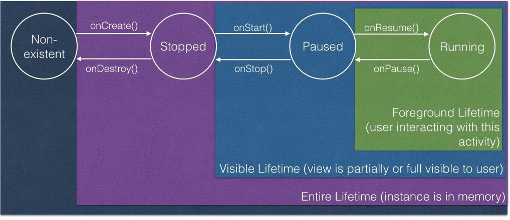
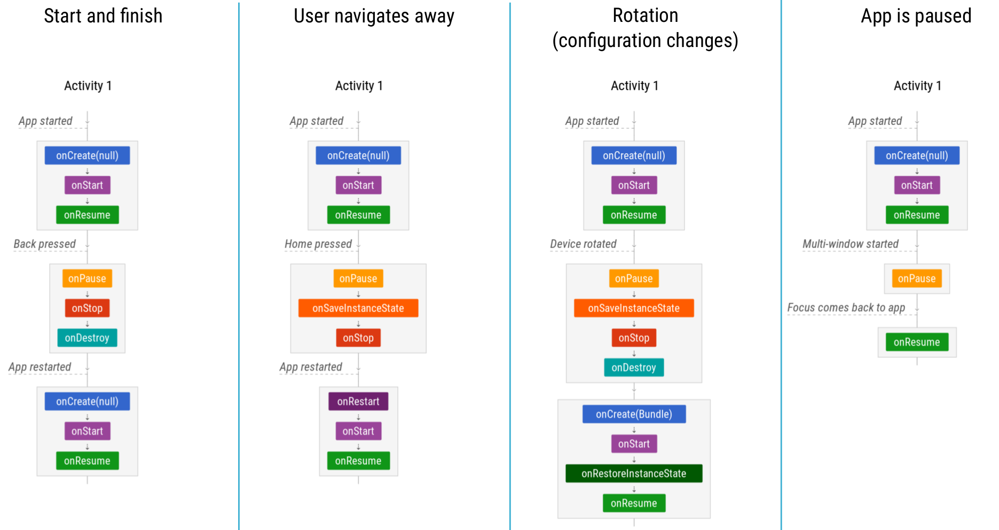
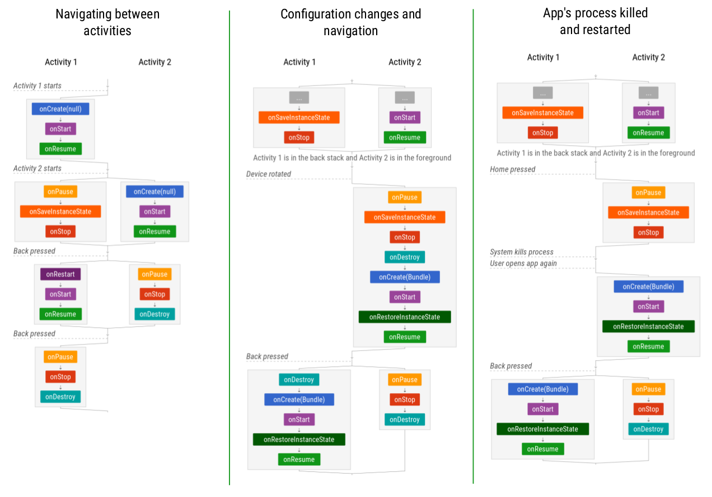

What is Activity?
---

اکتیویتی چیست؟
---


اکتیویتی‌ها یکی از بلاک‌های سازنده اپلیکیشن‌های اندرویدی هستند، هر صفحه در اپلیکیشن‌ها حتما یک اکتیویتی است.

اکتیوتی چیزی فراتراز یک کلاس‌ جاوا در فریمورک اندروید نیست که رابط کاربری اپلیکیشن‌ها را می‌سازد. 

مثل اپلیکیشن‌های جاوا که از متد main() شروع می‌شوند، اغلب اپلیکیشن‌های اندرویدی هم از یک اکتیوتی‌ شروع می‌شوند و می‌توانیم بعد از آن چند اکتیویتی دیگر داشته باشیم.


کار نمونه‌سازی اکتیوتی‌ها و مدیریت‌ آن‌ها به عهده سیستم‌عامل اندروید است. یعنی خود اندروید آن‌ها را مدیریت می‌کند و ما فقط می‌توانیم درخواست خود را برای استفاده از آن‌ها به وسیله Intentها به اندروید بفرستیم و اندروید کار موردنظر را برای انجام دهد.


استفاده از اکتیوتی‌ها و اینتنت‌ها به اندروید این امکان را می‌دهد که از آخرین اینتنت‌های اجرا شده و در واقع از آخرین اولیت‌های کاربر آگاهی داشته باشد و بتواند براساس آن منابع را مدیریت کند.


چرخه حیات
---

هر چیزی دارای یک چرخه حیات است، روزی به وجود می‌آید و روزی هم ازبین می‌رود. اکتیوتی‌ها هم از این قاعده مستثنا نیستند. یک زمانی در ram(حافظه) به وجود می‌آیند و یک زمانی هم از آن پاک شده و ازبین می‌روند.

این چرخه حیات به شکل زیر است:


عکس چرخه حیات


هر برنامه اندرویدی هنگام باز شدن در یک پراسس جدا اجرا می‌شود، این کار باعث می‌شود تا همه اطلاعات اپلیکیشن از اپلیکیشن‌های دیگر جدا باشد.


اکتیویتی‌ها و بقیه اجزای اپلیکیشن در حالت عادی در پراسس مربوط به اپلیکیشن به وجود می‌آیند.

 اکتیویتی‌ها چرخه زندگی مربوط به خود را دارند و در این چرخه مراحل مختلفی را طی می‌کنند. 


اکتیوتی‌ها در سیستم اندروید وضعیت‌های مختلفی دارند که در تصویر زیر نمایش داده شده است.





هرزمان که اکتیوتی‌ها بین این حالات جابجا می‌شوند، اندروید با یک کال‌بک ما را خبر می‌کند.


این هم نمودار کال‌بگ‌ها است:


۶ کال‌بک اصلی در چرخه‌حیات اکتیویتی وجود دارد: 

onCreate(), onStart(), onResume(), onPause(), onStop(), and onDestroy()

که در مورد هر یک از آن‌‌ها صحبت می‌کنیم.


کال‌بک‌های چرخه حیات:


onCreate:


بعد از آنکه instance اکتیویتی در مموری ساخته می‌شود، اولین کال‌بکی که صدا زده می‌شود OnCreate است.


یعنی قبل از صدا زدن OnCreate  اصلا اکتیویتی در مموری وجود ندارد.


زمانی که این متد صدا زده می‌شود، کارهایی که در آن نوشته‌ایم انجام می‌شود و اگر متد super آن را صدا زده باشیم، کارهایی که در آن هست هم انجام می‌شود مثل restore کردن ویو‌ها.


این متد همیشه زمانی‌ که اکتیویتی ساخته می‌شود اجرا خواهد شد. یعنی هر زمان که نمونه‌ای از آن ساخته می‌شود.


کارهایی که باید در این متد انجام شود:

در این متد باید تمام کار‌هایی که می‌خواهیم برای یک بار در طول زندگی اکتیویتی انجام شود را اعمال کنیم.

مثلا در این متد باید ویو‌ها را مقداردهی کنیم و داده‌ها را به لیست‌ها بایند کنیم.


این متد یک مقدار ویودی دارد که حاوی داده‌های ذخیره‌شده وضعیت قبلی اکتیویتی است. اگر اکتیویتی برای اولین بار اجرا شود این مقدا null خواهد بود.


کارهایی از قبیل ست کردن ویو به اکتیویتی با متد setContentView هم در اینجا انجام خواهد شد.


اما راه دیگری هم به جای استفاده از این متد وجود دارد و آن این است که آبجکت‌های ویو را  بسازیم و به یک ویوگروپ اد کرده و به setContentView پاس بدهیم.


 


توجه داشته باشید که در همه کال‌بک‌ها حتما متد super آن را قبل از آنکه کار دیگری انجام دهید صدا بزنید تا ویو‌ها مقدار‌ قبلی خود را بگیرند.


بعد از آنکه OnCreate اجرا شد، بلافاصله وارد وضعیت بعدی( Visible LifeTime) می‌شویم و متد OnStart هم صدا زده خواهد شد.


OnStart


وقتی که اکتیویتی وارد وضعیت visible می‌شود،‌ این کال‌بک صدا زده خواهد شد.


زمانی که این کال‌بک صدا زده‌ می‌شود،‌ صفحه اکتیویتی به کاربر نمایش داده شده است. این مرحله‌ای است که اکتیویتی درحال آماده شدن برای ورود به وضعیت foreground و تعامل با کاربر است.


این وضعیت به سرعت اجرا شده و بعد از آن اکتیویتی وارد مرحله foreground می‌شود.


در این کال‌بک بهتر است کار‌هایی از قبیل نگهداری از ui و یا مقداردهی یک Broadcast Receiver را انجام دهیم. معمولا کارهای خیلی طولانی را نباید در این قسمت انجام دهیم.


OnResume


بعد از آنکه اکتیویتی وارد وضعیت Foreground می‌شود

متد OnResume صدا زده می‌شود. در این کاربر می‌تواند با اکتیوتی کار کند. اکتیویتی در این حالت می‌ماند تا زمانیکه اکتیویتی دیگری اجرا شود و یا اتفاقی بیفتد که وضعیت اکتیویتی را تغییر دهد.


   

به محض آنکه وضعیت اکتیوتی تغییر می‌کند، اکتیویتی ابتدا وارد وضعیت Visible شده و سپس متد OnPause صدا زده خواهد شد.

باید برعکس تمام کارهایی که در OnResume را انجام می‌دهیم در OnPauseانجام دهیم، مثلا اگر Camera را در OnResume مقداردهی می‌کنیم باید آن را در OnPause خالی کنیم.


در این متد فقط باید منابعی که کاربر در حین استفاده فقط به آنها نیاز دارد را مقداردهی کنیم.

مثل انیمیشن‌ها.


 onPause


در اولین زمانیکه کاربر اکتیویتی شما را ترک می‌کند این متد صدا زده خواهد شد. 

ترک کردن اکتیویتی می‌تواند شامل بک‌زدن کاربر یا باز شدن اکتیویتی دیگر و یا نمایش یک دیالوگ باشد و یا حتی در حالت Multi Screen که کاربر با برنامه دیگری در حال کارکردن است.

حتی اگر یک اکتیویتی دیگر با صفحه transparent لانچ شود، و اکتیویتی قبلی هنوز نمایان باشد، در این حالت باقی می‌ماند.


در این متد باید کارهایی از قبیل متوقف‌کردن انیمیشن‌ها، خالی کردن ریسورس‌هایی از قبیل برادکست‌ها  و ... که کاربر به آن‌ها نیاز ندارد، را انجام داد.


نباید در این متد کارهای طولانی از قبیل ذخیره داده‌ها در دیتابیس و ... را انجام داد. این متد باید خیلی سریع اجرا شود پس کارهای خیلی طولانی در آن انجام ندهید.

برای انجام کارهای نهایی طولانی و سنگین باید از onStop استفاده کنیم.

بعد از آنکه onPause  تمام شد با کمی تاخیر و نه بلافاصله متد OnStop اجرا خواهد شد.


OnStop


زمانیکه اکیتویتی دیگر به کاربر نمایش داده نمی‌شود وارد این وضعیت شده و متد onStop صدا زده خواهد شد.

همچنین در زمانیکه اکتیوتی در حال نابود شدن است هم این متد صدازده خواهد شد(finish).


OnStop آخرین جایی که حتما اجرا می‌شود پس حتما تمام کارهایی که باید انجام دهید را در آن انجام دهید و کاری را به OnDestroy نسپارید چرا که ممکن است اصلا صدا زده نشود.


حتما در onStop همه ریسورس‌هایی که در OnStart گرفته‌اید را آزاد کنید.

همچنین منابعی که ممکن است باعث مموری‌لیک شوند را در اینجا آزاد کنید. 

تمام کارهای سنگین و آن‌هایی که زمان زیادی برای انجام می‌خواهند را در این متد انجام دهید مثل ذخیره اطلاعات کاربر.


 

زمانیکه در وضعیت stop قرار داریم، نمونه اکتیویتی در مموری می‌ماند و تمام متغیر‌ها و ... هم باقی خواهند ماند و فقط اکتیوتی به windowManager متصل نیست و صفحه به کاربر نمایش داده نمی‌شود. 

پس زمانیکه به OnResume باز میگردیم همه چیز سر جای خود قرار دارد.


همچنین state همه View ها نیز توسط اکتیویتی نگه‌داری می‌شود  و نیازی نیست تا آنها را نگه داریم. 

حتی اگر به سیستم‌عامل اکتیوتی را از بین هم ببرد باز هم زمانیکه دوباره آن را اجرا می‌کنیم، مقادیر ویو باز گردانده می‌شود.


از وضعیت Stopped یا دوباره اکتیوتی به حالت Resume باز می‌گردد و یا finish می‌شود، اگر به حالت Resume  باز گردد متد onRestart صدا زده خواهد شد و اگر finish شود متد OnDestroy صدا زده می‌شود.


onDestroy


این متد قبل از آنکه اکتیوتی نابود شود صدا زده می‌شود مثلا زمانیکه متد finish() را کال می کنیم و یا زمانیکه سیستم‌عامل به خاطر کمبود حافظه پراسس را از بین می‌برد، بعد از onStop و قبل از آنکه همه‌چیز نابود شود این متد صدا زده خواهد شد.

البته با متد  isFinishing مس‌توانیم تفاوت این دو را متوجه شویم.


ممکن است سیستم عامل به خاطر orientation هم این متد ا صدا بزند که بلافاصله بعد از آن متد onCreate اجرا می‌شود.


وضعیت‌ها و کال‌بک‌های مختلف اکتیوتی در سناریو‌های زیر را بررسی می‌کنیم.








در حالتی که در یک اکتیویتی قرار داریم و یک اکتیویتی دیگر شروع به کار می‌کند، به طور دقیق‌تر ابتدا Onpause اکتیوتی اول اجرا شده و سپس onCreate,onStart,onResume اکتیویتی دوم صدا زده می‌شود و بعد از آن onStop اکتیویتی اول.


زمانی که اکتیویتی وارد حالت MultiWindow می‌شود و یا زمانی که یک دیالوگ قسمتی از صفحه را می‌گیرد، اکتیویتی وارد حالت onPause شده و بعد از زمانی که دوباره به اکتیویتی باز گردیم، onResume اجرا خواهد شد.


البته این مورد برای دیالوگ‌هایی که در اپ هستند صادق نیست و این دیالوگ‌ها باعث pause شدن اکتیویتی نمی‌شوند.


آمدن نوتیفیکیشن و یا پایین کشیدن نوتیفیکیشن‌بار هم باعث pause شدن اکتیویتی نمی‌شود.


زمانی که configuration change اتفاق می‌افتد دو حالت پیش می‌آید. یا ما به اندروید می‌گوییم که کاری انجام ندهد و این تغییرات را خودمان هندل می‌کنیم(با استفاده از تگی در مانیفست) و یا این تغییرات را اندروید مدیرییت می‌کند و کاری که انجام می‌دهد آن است که اکتیویتی را نابود کرده و دوباره می‌سازد تا همه تنظیمات به درستی اعمال شود.

در این حالت است که متد onSaveInstanceState صدا زده می‌شود.


توجه داشته باشید زمانی که کلید بک زده می‌شود، دیگر متد onSaveInstanceState صدا زده نخواهد شد و اکتیویتی نابود می‌شود چرا که از بک چنین انتظاری می‌رود و خود کاربر این درخواست را دارد.


اکتیویتی‌ها در مانیفست
---
هر اکتیوتی که در برنامه استفاده می‌شود باید حتما در Manifest برنامه شما معرفی شود تا اندروید اجازه استفاده از آن (launch  شدن) را به شما بدهد.

می‌توانیم برای اکتیوتی‌ها در مانیفست اطلاعاتی را درج کنیم و با آن اطلاعات به اندروید بگوییم که این اکتیویتی در برنامه ما چه وظیفه‌ای دارد. 

مثلا زمانی که یک برنامه اندرویدی درخواست استفاده از یک برنامه ایمیل را برای ارسال ایمیل می‌دهد، در واقع دارد با استفاده از اینتنت‌ها یک اکتیوتی از برنامه‌ای دیگر که به عنوان اکتیویتی ارسال ایمیل معرفی شده است را اجرا می‌کند. 


دلیل آنکه آن اکتیویتی در برنامه ایمیل به عنوان اکتیوتی ارسال ایمیل معرفی شده است،‌ اطلاعات اضافه‌ای است که درباره آن اکتیویتی در مانیفست برنامه ایمیل نوشته شده است.


Intent Filterها 
---

اینتنت‌فیلتر‌ها ابزار‌های قدرتمندی برای اجرای نه تنها اینتنت‌های مستقیم است بلکه برای اینتنت‌های غیرمستقیم هم استفاده می‌شود.


مثل همان اینتنتی که برای ارسال ایمیل زدیم، اینبار فرض کنید به جای آنکه بگوییم دقیقا اکتیوتی ارسال ایمیل یک اپلیکیشن خاص را اجرا کند(explicit request)،‌ می‌گوییم تا اکتیوتی ارسال ایمیل را در هر اکتیوتی و در هر برنامه‌‌ای که در گوشی وجود دارد و این قابلیت را دارد(implicit request)، اجرا کند. 

در این زمان است که دیالوگ یا باتن‌شیت انتخاب اپلیکیشن‌ می‌آید و می‌توانیم از بین اپلیکیشن‌های موجود یکی را انتخاب کنیم.


نحوه تغریف اکتیویتی با implicit request به صورت زیر است.

```xml
‍‍<activity android:name=".ExampleActivity" android:icon="@drawable/app_icon">
    <intent-filter>
        <action android:name="android.intent.action.SEND" />
        <category android:name="android.intent.category.DEFAULT" />
        <data android:mimeType="text/plain" />
    </intent-filter>
</activity>
```

حداقل attr لازم برای تعریف یک اکتیویتی نام کلاس آن اکتیوتی در برنامه است.


اما می‌توانیم مقادیر دیگری را هم به آن بدهیم: مثل


  <action> کاری که می‌تواند انجام دهد.


 <category>  اگر DEFAULT  باشد، به اکتیوتی اجازه دریافت درخواست‌های اجرا را می‌دهد.


و  <data> هم نوع داده‌ای که می تواند ارسال کند را مشخص می‌کند.


کد جاوای اجرای چنین اکتیوتی به صورت زیر است:


```java
// Create the text message with a string
Intent sendIntent = new Intent();
sendIntent.setAction(Intent.ACTION_SEND);
sendIntent.setType("text/plain");
sendIntent.putExtra(Intent.EXTRA_TEXT, textMessage);
// Start the activity
startActivity(sendIntent);
```

اگر برنامه‌اتان را طوری طراحی کردید که فقط باید از داخل برنامه آن کار را انجام دهد، به هیچ‌وجه نباید این اطلاعات را در مانیفست بنویسید. بلکه باید از داخل خود برنامه اینتنت را اجرا کنید.


permissionها: 
---


می‌توانیم از تگ اکیتویتی در مانیفست برای تعریف پرمیشن‌های جدید استفاده کنیم. 

در این صورت اگر اپ دیگری این پرمیشن را نگیرد، نمی‌تواند آن اکتیوتی را لانچ کند.


```xml
<manifest>
<activity android:name="...."
   android:permission=”com.google.socialapp.permission.SHARE_POST”

/>
```


```xml
<manifest>
   <uses-permission android:name="com.google.socialapp.permission.SHARE_POST" />
</manifest>
```


هندل کردن تغیر وضعیت‌های اکتیویتی
---

start کردن اکتیوتی‌ها

به دو صورت می‌توانیم اکتیویتی‌ها را start کنیم، مورد اول با startActivity  و  مورد دوم با startActivityResult .


همواره از مورد اول استفاده می‌کنیم مگر آنکه بخواهیم از اکتیویتی دوم مقداری را به عنوان جواب بگیریم. مثل زمانی که کاربر می‌خواهد از کانکت‌ها شماره تلفن یک نفر را بگیرد.


ذخیره وضعیت اکتیویتی 

برای ذخیره وضعیت اکتیویتی از کال‌بک onSaveInstanceState استفاده می‌کنیم.


در آنجا مقادیری که می خواهیم کنیم را به صورت باندل به ذخیره کرده و به متد سوپر پاس می‌دهیم.


برای بازیابی این مقادیر یا آن‌ها را از باندل onCreate میگیریم و یا در متد onRestoreInstanceState.


تفاوت دریافت در این دو جا تنها در این است که مقدارباندل درون

onCreate می‌تواند null باشد ولی مقدار درون متد onRestoreInstanceState همیشه non-null است چرا که این متد فقط زمانی کال می‌شود که باندل مقدار داشته باشد


تفاوت دیگر این است که متد onRestoreInstanceState بعد از onStart صدا زده می شود.


برای آنکه وضعیت ویو‌ها به درستی و خودکار لود شود لازم است تا همه ویو‌هایی که نیاز به این کار دارند id  داشته باشند.


نکته قابل توجه آن است که باندل تنها مقدار محدودی از داده‌ها را می‌تواند نگه دارد.


برای نگه‌داری همه نوع داده باید ترکیبی از چند کار را انجام  دهید.


ذخیره داده‌ها در local storage، استفاده از onSaveInstanceState و ViewModel class.


سوال و جواب
---

**سوال:**

زمانی که کاربر اپ را کیل(از ریسنت‌ها بیرون می‌اندازد) می‌کند، چه اتفاقی برای اکتیویتی و برنامه می‌افتد؟


**پاسخ:**

زمانی که کاربر دکمه recent apps را می‌زند تا اپ‌های اخیر نمایش داده شوند، در اکتیویتی که فعال است بلافاصله متد onPause صدا زده می‌شود و بعد از آن متد onStop  (ممکن است کمی تاخیر داشته باشد و بلافاصله اجرا نشود) صدازده می‌شود .

حال اگر کاربر اپ را کیل کند و از لیست برنامه‌های اخیر بیرون بیندازد،‌کلا برنامه از مموری خارج می‌شود، و بدون آنکه متد onDestroy اکتیویتی صدازده‌شود، اکتیویتی و همه جزییات آن از بین‌می‌رود.
علاوه بر آن همه جزییات برنامه (کلاس اپلیکیشن و ... ) نیز از مموری خارج می‌شود. 
راه مقابله با این کار ذخیره اطلاعات موردنظر در onStpo و یا در برخی مواقع onPause است.


**سوال:**

در اندروید چطور تغییر وضعیت‌های مختلف را هندل کنیم؟ چه کارهایی می‌توان انجام داد؟ چه راه‌حل‌هایی وجود دارد؟ چطور انجام می‌شود؟
(منظور از تغییر وضعیت config changes اندروید است)


**پاسخ:**

در رابطه با این مساله سه راه‌حل کلی وجود دارد: 

۱-بستن چرخش صفحه: در این حالت مثل اینستاگرام و خیلی از برنامه‌ها، اجازه چرخش صفحه به کاربر داده‌ نمی‌شود. برای بستن چرخش صفحه در مانیفست خصیصه زیر را برای اپلیکیشن و یا یک اکتیویتی خاص استفاده می‌کنیم.

android:screenOrientation="landscape"


۲-جلوگیری از recreate شدن اکتیویتی:

در این روش به اندروید می‌گوییم تا دیگر در هنگام چرخش صفحه، اکتیویتی (view) را recreate نکند، برای این کار از تگ زیر در مانیفست استفاده می‌کنیم.

android:configChanges="keyboardHidden|orientation" 

زمانی که این کار را انجام می‌دهیم، در لایف‌سایکل اکتیویتی متد onConfigurationChanged(Configuration) صدا زده می‌شود. درواقع در این حالت باید خودمان تغییراتی که برای اکتیوتی نیاز است را انجام دهیم. 
 

۳-ذخیره وضعیت صفحه و بازیابی آن پس از ساخت ویو جدید: که خود این کار برای داده‌های ساده و داده‌های پیچیده متفاوت است.

معمولا در این روش از ترکیبی از متد onSaveInstanceState() و ViewModelها استفاده می‌کنیم. 
از onSaveInstanceState() برای ذخیره و بازیابی اطلاعات ساده و از viewModel برای ذخیره و بازیابی اطلاعات و وضعیت‌های پیچیده‌تر استفاده می‌کنیم. که این کار در طول ازبین‌رفتن و ساخت مجدد اکتیوتی اطلاعات را برای ما نگه‌داری می‌کند.


منابع
---

https://developer.android.com/guide/components/activities/intro-activities


https://academy.realm.io/posts/activities-in-the-wild-exploring-the-activity-lifecycle-android/


https://www.bignerdranch.com/blog/android-activity-lifecycle-onStop/


https://developer.android.com/guide/components/activities/activity-lifecycle


https://medium.com/google-developers/the-android-lifecycle-cheat-sheet-part-i-single-activities-e49fd3d202ab


https://medium.com/sketchware/activity-lifecycle-in-android-applications-1b48a7bb584c


https://developer.android.com/guide/components/activities/state-changes


https://developer.android.com/topic/libraries/architecture/viewmodel
