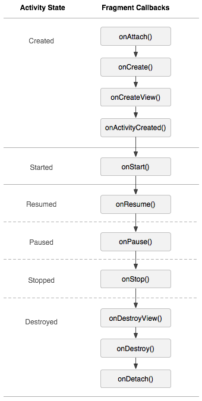
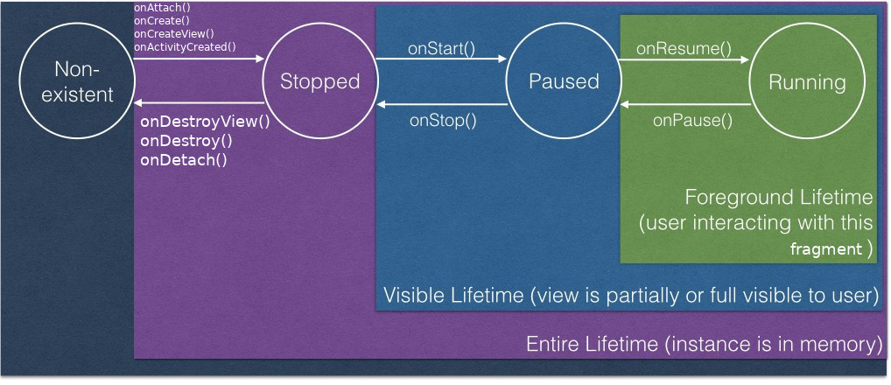
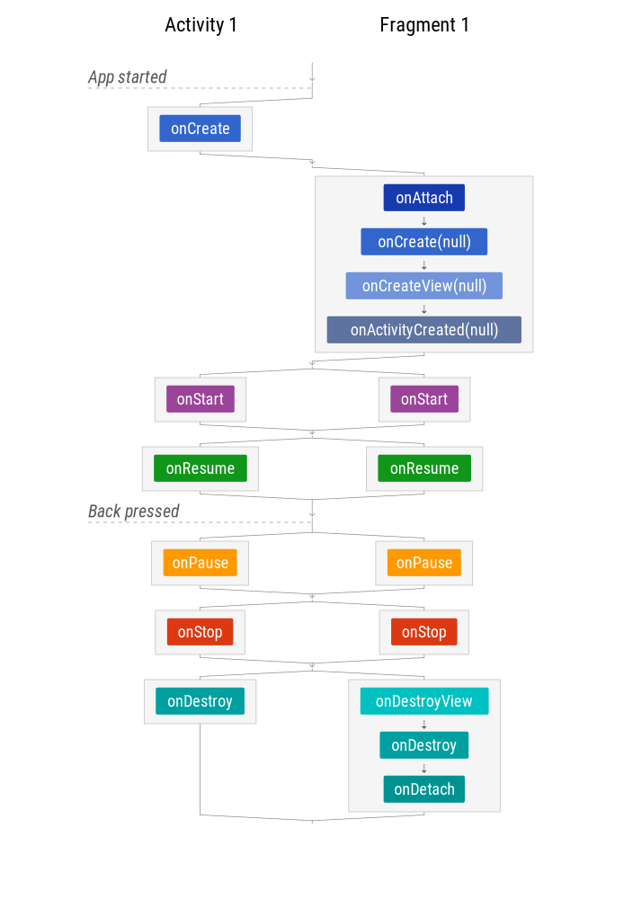
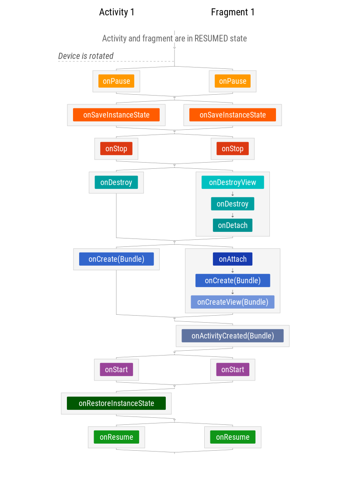
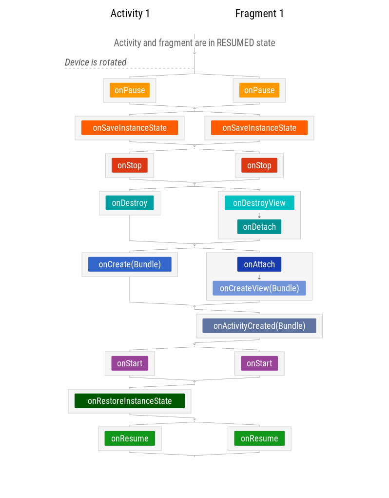

فرگمنت چیست؟
---
فرگمنت یک رفتار یا بخشی از ui است. در واقع می‌توان آن را یک مازول مجزا در نظر گرفت که به عنوان بخشی از ui در اکتیویتی به کار می‌رود. داده‌های ورودی و خروجی خودش را دارد، لایف سایکل خودش را دارد و می‌تواند به یک اکتیویتی در حال اجرا اضافه شود و یا از آن کم شود.
می‌توانیم از فرگمنت‌ها برای ساختن ui های چندبخشی مثل عکس زیر استفاده کنیم.


  عکس بالا فلسفه طراحی برنامه‌ها با فرگمنت را نشان می‌دهد. بهتر است از فرگمنت‌ها به عنوان یک ماژول مجزا استفاده کنیم به این صورت که هر فرگمنت اطلاعات ورودی خود را گرفته و ui خودش را نشان دهد و از آن طرف هم اگر کاربر کاری انجام داد، کارهای خودش را خودش انجام دهد.

در این حالت فرگمنت ما یک ماژول قابل استفاده می‌شود که می توانیم از آن در اکتیویتی‌های
دیگر نیز استفاده کنیم.


چرخه حیات فرگمنت (fragment lifecycle)
---


فرگمنت‌‌ها با هدف ساخت ui های منعطف و مدیریت راحت‌ آن‌ها به وجود آمده‌اند.


اضافه کردن فرگمنت به اکتیویتی
---
اضافه کردن به وسیله لایه‌های xml:
یک آیتم به نام فرگمنت به لایه‌های xml اضافه کرده و نام کلاس فرگمنت را در آن مینویسیم، سپس خود اندروید به هنگام ساخت آن اکتیویتی، فرگمنت را هم میسازد.


اضافه کردن به وسیله کد‌های جاوا:
با استفاده از کد زیر فرگمنت را اضافه می‌کنیم.

```java
FragmentManager fragmentManager = getSupportFragmentManager();
FragmentTransaction fragmentTransaction = fragmentManager.beginTransaction();

ExampleFragment fragment = new ExampleFragment();
fragmentTransaction.add(R.id.fragment_container, fragment);
fragmentTransaction.commit();
``` 

مدیریت فرگمنت‌ها
---
برای مدیریت فرگمنت‌ها از FragmentManager استفاده می‌کنیم. به وسیله آن می‌توانیم لیست فرگمنت‌های موجود در اکتیویتی را بگیریم، findFragmentById و یا findFragmentByTag.
انداختن فرگمنت‌ها به بیرون از بک‌استک با popBackStack. یا مانیتور کردن تغییرات بک‌استک با لیسنر  addOnBackStackChangedListener().


ارتباط با اکتیویتی
---
برای آنکه از یک فرگمنت با اکتیویتی پدرش در ارتباط باشیم می توانیم از SharedViewModel استفاده کنیم، اما اگر کافی نبود، از یک اینترفیس استفاده می‌کنیم که در فرگمنت صدا ده شده و در اکتیویتی implement می‌شود تا فرگمنت بتواند اطلاعات خود را به اکتیویتی برساند.


مدیریت چرخه حیات فرگمنت
---
مدیریت چرخه حیات فرگمنت‌ها نیز مانند مدیریت چرخه حیات اکتیویتی‌هاست.
مانند اکیتیویتی، فرگمنت‌ هم چهار وضعیت دارد:

۱-Non-Existent:

زمانی است که فرگمنت هنوز ساخته نشده است و مموری وجود ندارد.


۲-Stopped:

زمانی است که فرگمنت ساخته شده و instance آن در مموری وجود دارد ولی فرگمنت و اکتیویتی‌هاست آن نمایش داده نمی‌شوند و یا فرگمنت در بک‌استک وجود دارد و یا حذف شده است.


۳-Paused

زمانی است که فرگمنت و اکتویتی‌هاست آن نیمه نمایان یا کاملا نمایان هستند ولی کاربرروی آن‌ها
فوکوس نکرده است.


۴-Runing

زمانی است که فرگمنت و اکتیویتی‌هاست آن درحال نمایش ‌هستند و در وصعیت فعال قرار دارند.


دقت کنید که چرخه حیات فرگمنت وابسته به چرخه حیات اکتیویتی پدرش است. 








کال‌بک‌های موجود در فرگمنت همانند کال‌بک‌های اکتیویتی‌ها هستند، یعنی هر کال‌بکی که در اکتیویتی داریم در فرگمنت‌ هم وجود دارد و همزمان با هم صدا زده می‌شوند به این صورت که زمانی که مثلا onPause  اکتیویتی صدا زده می‌شود، onPause  همه فرگمنت‌های موجود در آن نیز صدا زده می‌شوند. اما در فرگمنت تعدادی کال‌بک اضافی نیز وجود دارد. 

این کال‌بک‌های اضافی ان‌ها هستند:

onAttach

زمانی صدا زده می‌شود که فرگمنت با اکتیویتی همراه شده است.


onCreateView

صدازده می‌شود تا ویو مربوط به فرگمنت را در آن بسازیم.


onActivityCreated

زمانی صدازده می‌شود که متد onCreate اکتیویتی return کرده باشد.


onDestroyView

زمانی صدازده می‌شود که ویو مربوط به فرگمنت درحال حذف‌شدن باشد.


onDetach

زمانی صدازده می‌شود که فرگمنت در حال جداشدن از اکتیویتی پدرش باشد.


فقط زمانیکه اکتیویتی پر در حالت Running  قرار دارد، فرگمنت می‌تواند به صورت آزادانه چرخه‌حیات خود را کنترل کند.


بررسی چند سناریو
---
حالا برای فهمیدن بهتر چرخه‌حیات فرگمنت چند سناریو را بررسی می‌کنیم:


### سناریو ۱ - فرگمنت با اکتیویتی شروع‌شده و با آن تمام می‌شود:




نکته‌ای که در این دیاگرام وجود دارد آن است که کال‌بک‌هایی که در کنار هم وجود دارند، لزوما به ترتیب صدازده نمی‌شوند، بلکه پارالل اجرا می‌شوند. یعنی ممکن است ابتدا onStart اکتیویتی صدازده و بعد onStart فرگمنت و بلافاصله یعد از آن onResume  فرگمنت صدازده شده و سپس onResume اکتیویتی.

  

### سناریو ۲ - فرگمنت همراه با اکتیویتی بچرخند:




وضعیت فرگمنت بسیار شبیه به وضعیت اکتیویتی ذخیره و بازگردانی می‌شود، با این تفاوت که در فرگمنت onRestoreInstanceState()  نداریم بلکه باندل در onCreate(), onViewCreated() و onActivityCreated() در دسترس است.


### سناریو ۳ - فرگمنت نگه‌داری‌شده همراه با اکتیویتی بچرخند:

می‌توانیم فرگمنت را در چرخش‌ها نگهداریم(retain). برای این کار setRetainInstance(true) را انجام می‌دهیم. با این کار دیگر فرگمنت از اول ساخته نمی‌شود بلکه در مموری نگه‌داری شده و بعد از چرخش از همان instance قبلی استفاده می‌شود.
 




استفاده از فرگمنت‌ retain شده اصلا پیشنهاد نمی‌شود مگر در مواردی که فرگمنت ui ندارد و از آن برای جابجایی داده استفاده می‌شود. که این کار را ViewModel  با api  ساده‌تر انجام می‌دهد.


چند نکته درباره فرگمنت‌ها
---

زمانی که onSaveInstanceState()  اکتیویتی‌ صدازده می‌شود، خود اکتیویتی تمام ویو‌هایی که id  دارند را ذخیره کرده و پس از آنکه اکتیویتی دوباره ساخته شد، تمام مقادیر ویو‌ها خودکار بازگردانی می‌شوند. 


زمانی که صفحه rotate  می‌شود یا به‌طور واضح‌تر هر زمان که فرگمنت به‌وسیله سیستم ازبین برود، فرگمنت هم مانند اکتیویتی عمل خواهد کرد. یعنی متد‌های onSaveInstanceState() و... صدا زده خواهند شد.
تنها یک نکته در فرگمنت‌ها فرق دارد: 
زمانی که فرگمنت‌ به بک‌استک می‌رود، ویو‌ آنها از مموری پاک‌شده و بعد از آنکه دوباره نمایش داده می‌شود، ویو آن دوباره از ابتدا ساخته می‌شود. یعنی خود فرگمنت و instance آن وجود دارند، اما ویو فرگمنت پاک‌شده و از اول ساخته می‌شود. 

//عکس مربوط به فرگمنت


در این حالت هیچ save Instance ی رخ نخواهد داد. مشکلی نیست چرا که فرگمنت اینطور پیاده‌سازی   شده است. در این حالت Save Instance داخلی ویو‌ها صدازده می‌شود و ویو را مقداردهی می‌کند.
برای مثال editText و یا TextViewیی که id داشته باشد و  android:freezeText="true" آن تنظیم شده‌باشد، مقدار اولیه آن ویو بازخواهد گشت.
اما نکته اینجاست که باید Save/Restore State  داخلی همه ویو‌ها ایمپلمنت شده باشد.

در هرحالت سعی کنید State فرگمنت را از State ویوها کاملا جدا کنید.


 فرق اکتیویتی و فرگمنت چیست؟
---
اکتیویتی جز اصلی برنامه‌های اندرویدی است. اگر بخواهیم به کاربر چیزی را نشان دهیم باید حتما از طریق اکتیویتی نشان دهیم. اما فرگمنت یک بسته ui یا رفتاری است که می‌توان آن را در جاهای مختلفی از جمله اکتیویتی استفاده کرد.


اگر بخواهیم مقداری از این ویو را ذخیره کنیم، در کجا این کار را انجام میدهیم؟
---
در اکتیویتی برای ذخیره اطلاعات از کال‌بک onStop  استفاده می‌کنیم، چرا که آخرین کال‌بکی که حتما صدازده می‌شود، این کال‌بک است.
برای توضیات بیشتر در رابطه با این موضوع به قسمت اکتیویتی مراجعه شود.


در فرگمنت هم برای ذخیره اطلاعات از همان متد‌های داخل اکتیویتی استفاده می‌شود، با این تفاوت که در فرگمنت متد onRstoreInstanceState() وجود ندارد و باید باندل اطلاعات را از onCreate(), OnActivityCreated()  و یا OnCreateView()  بگیریم و وضعیت قبلی را برگردانیم.

  
مشکلات استفاده از setRetainInstanceState  در فرگمنت چیست؟
---
اگر فرگمنت به ‌بک‌استک add شود و یا شامل ui باشد، نمایش آن به مشکل می‌خورد. از این ویژگی فقط در مواردی استفاده می‌کنیم که فرگمنت ui ندارد و فقط نگه‌دارنده dataاست. که البته لایبرری ViewModel  این کار را بهتر از فرگمنت انجام می دهد.


چطور ویو فرگمنت را در orientation هندل کنیم؟
--- 
دقیقا همانطوری که در اکتیویتی این کار را انجام داده‌ایم. تنها تفاوت این دو در این است که فرگمنت متد onRestoreInstanceState() را ندارد و باندل داده‌ها را در سه متد onActivityCreated(), OnCreateView() و OnCreate() برگردانده می‌شود.


android fragment چه فرقی با support fragment دارد؟
---
نسخه support.Fragment از پایداری بالاتری برخوردار است و می‌توان از آن در نسخه‌های قدیمی‌تر اندروید تا Api 11 هم استفاده کرد.
رفتار این نسخه نسبت به android.Fragment  در ورژن‌های مختلف اندروید و گوشی‌های مختلف پایدارتر و یکسان‌تر است.


لایف‌سایکل فرگمنت چه ربطی به لایف‌سایکل اکتیویتی دربردارنده آن دارد؟
---
هر دو یکسان هستند و کال‌بک‌های onStart() , onResume(), onPause()  و onStop()  در هردو یکی هستند و فقط فرگمنت تعدادی کال‌بک اضافه‌تر دارد. این چهار کال‌بک نامبرده شده به صورت Async  در فرگمنت و اکتیویتی اجرا می‌شوند و هیچ تضمینی نیست که مثلا کال‌بک اکتیویتی ابتدا اجرا شود و بعد از آن کال‌بک فرگمنت، مثلا ممکن است ابتدا onStart() فرگمنت اجرا شده و سپس onStart()  اکتیویتی و در ادامه ابتدا onResume() اکتیویتی اجرا شده و بعد onResume() فرگمنت.


منابع
---

https://developer.android.com/guide/components/fragments

https://developer.android.com/guide/practices/screens_support

https://gist.github.com/kaushikgopal/5c1b029798b73c73193d

https://medium.com/@JoseAlcerreca/the-android-lifecycle-cheat-sheet-part-iii-fragments-afc87d4f37fd