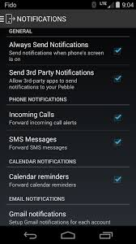
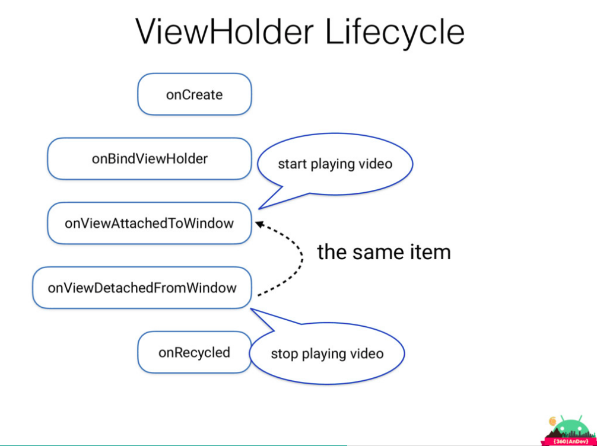
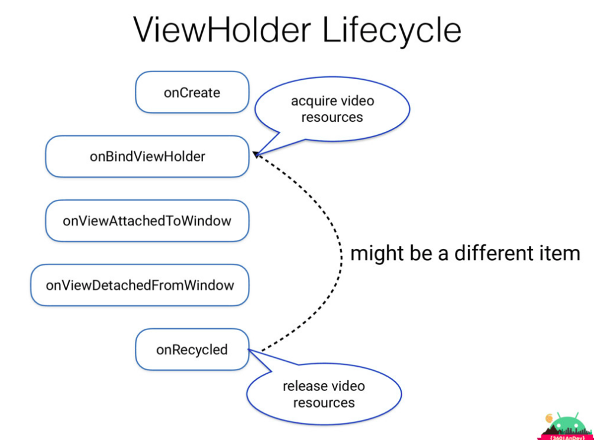
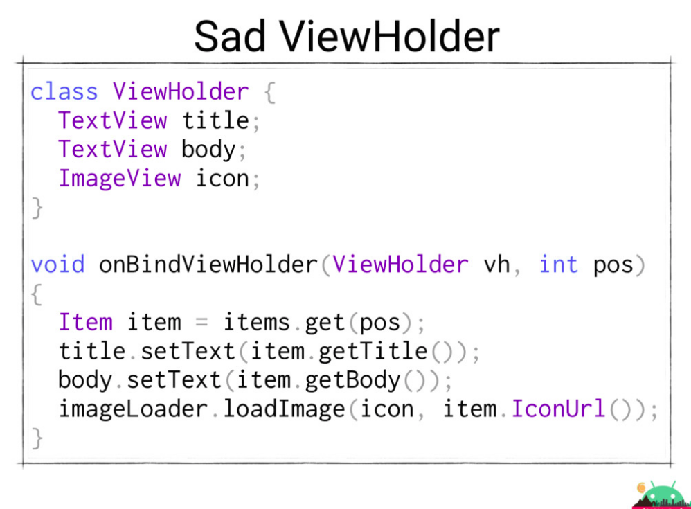
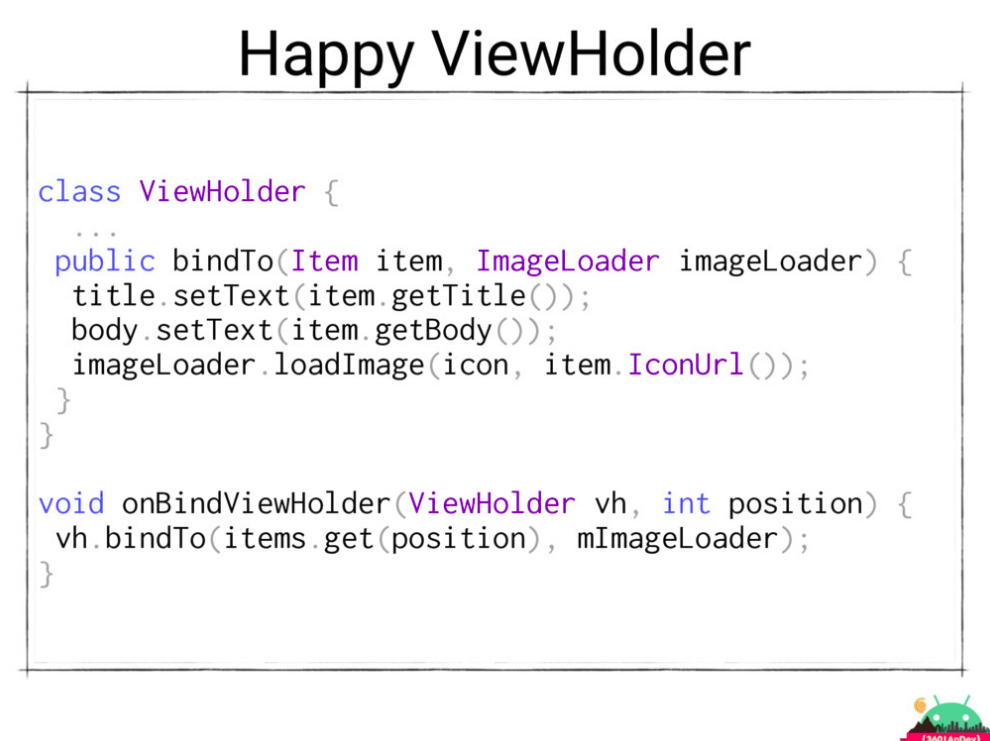
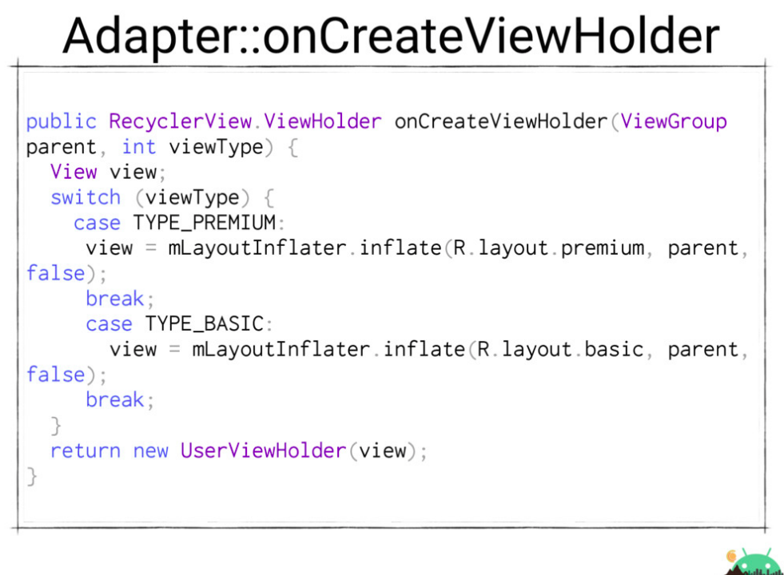
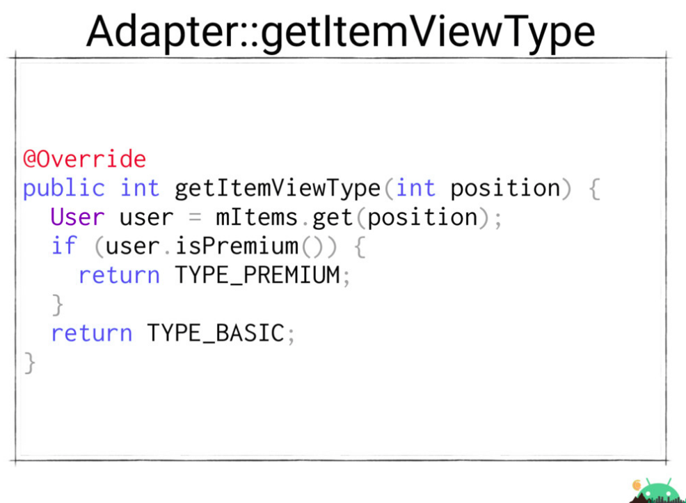
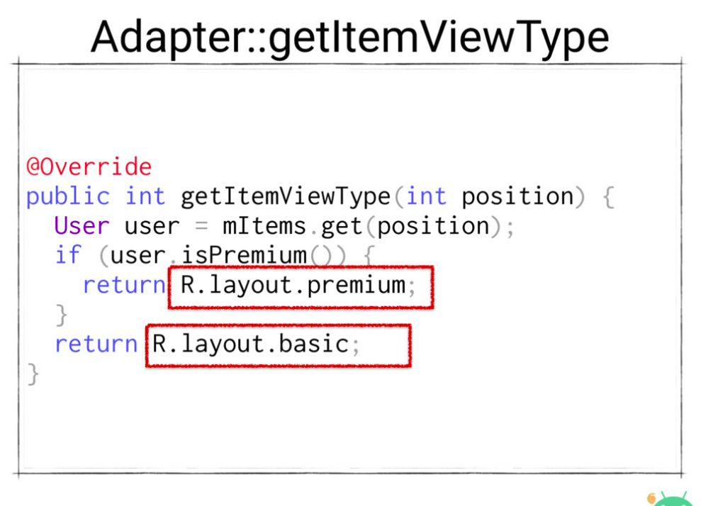
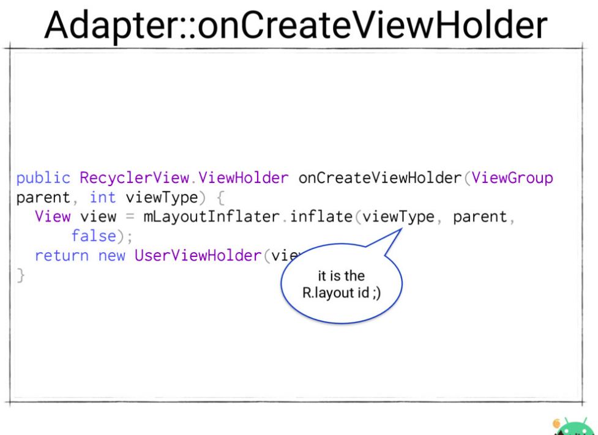

ریسایکلر‌ویو چیست و چه فرقی با لیست‌ویو دارد؟
---

از لیست‌ویو در کجا‌ها و از ریسایکلر‌ویو در چه جاهایی بهتر است استفاده کنیم؟
---

چطور یک لیست‌ویو یا ریسایکلر‌ویو با آیتم‌های متفاوت بسازیم؟
---

چطور در Heterogenous RecyclerView از چند ویوهولدر استفاده کنیم؟
---

چطور خودمان یک لیست‌ مثل کانتکت‌های گوشی با جدا کردن حروف الفبا بنویسیم؟
---

ارائه ریسایکلرویو realm
---
از لیست‌ویو در زمانی استفاده می‌شود که لیست‌هایی با آیتم‌های تکراری و محتوای ثابت داریم. مثل عکس زیر:

اما گاهی اوقات هم از آن‌ها برای لیست‌های پیچیده‌تر با آیتم‌های بیشتر استفاده می‌کردیم. در این مواقع برای استفاده بهینه از مموری از ترکیبی از lazy loading  و استفاده مجدد از ویو‌ها قبلی استفاده می‌کردیم.

**لیست‌ویو یک سری محدودیت و اشتباه داشت:** 
 استفاده نادرست از مموری و مشکلات مربوط به آن
نوشتن کلی کد برای reuseکردن ویو‌ها و استفاده بهینه از ویوها که باید توسط لیست‌ویو انجام می‌شد ولی توسط برنامه ندل می‌شد.
طراحی ناقص API
ویو آیتم کلیک‌لیسنر و آیتم کلیک لیسنر خود لیست‌ویو؟؟؟
انیمیشن‌ها
پیاده‌سازی لایه‌های پیچیده‌تر مثل GridView, Horizontal ListView, Staggerd GridView و... .

ریسایکلرویو تمام محدودیت‌ها و اشتباهات لیست‌ویو را برطرف کرده است.

**ریسایکلرویو از سه قسمت اصلی تشکیل شده است:**

-لیوت منیجر (Layout Manager): کار این قسمت جایگذاری آیتم‌ها در جای مناسب است و مسئولیت پوزیشن آیتم‌ها را بر عهده دارد.

-آیتم انیمیتور (Item Animator):  مسئولیت انیمیشن آیتم‌ها بر عهده این قسمت است.

-ادپتر (Adapter): مسئولیت فراهم‌کردن ویو‌ها نیز به عهده این قسمت می‌باشد.

 واقع ریسایکلرویو طوری طراحی شده است که به ماژولارترین حالت ممکن باشد، یعنی اگر خواستیم یک ویژگی جدید مثل Drag & Drop  داشته باشیم، نیاز نیست کار جدیدی کنیم، فقط قسمت تاچ جدیدی به ریسایکلر‌ویو می‌دهیم.
 در واقع نیامده‌ای چیز جدیدی برای ریسایکلر بنویسیم، بلکه هر ماژولی خواستیم به آن اضافه می‌کنیم.

استفاده درست از ریسایکلرویو
---
ویو‌ها در اندروید به وسیله requestLayout  اعلام می‌کنند که سایزشون تغییر کرده و باید دوباره اندازه‌گیری شوند. با شروع این کار هر ویو از پدر خودش  در درخت ویو‌ها می‌خواهد که اندازه‌اش را دوباره محاسبه و تنظیم کند. این کار همینطور به صورت بازگشتی ادامه پیدا می‌کند تا به ریشه ویو‌ها برسیم و در آنجاست که ریشه فریم بعدی را صدا زده و از فرزندانش می‌خواهد تا همین کار را کنند و همچنین اندازه‌های خودشان را محاسبه و بگویند.

این کار در ریسایکلرویو  پرهزینه است، چرا که همه ویو‌ها می‌خواهند از ابتدا رسم شوند. برای همین از SetFixedSize  در آنها استفاده می‌کنیم. مثال این مورد در هنگام لودکردن عکس‌ها می‌باشد. به این صورت که ابتدا تمام آیتم‌ها لود می‌شوند و بعد از آنکه عکسی دانلود شد و خواست لود شود، به پرنت خود می‌گوید که سایز من تغییر کرده و requestLayout می‌کند و این کار تا لایه ریشه ادامه پیدا می‌کند و هر بار که عکسی لود شود این کار تکرار می‌شود. 

در مثال بالا برای بالابردن پرفورمنس برای عکس‌ها ک سایز فیکسی تعیین می‌کنیم، با این کار هر بار که عکسی دانلود شود، به جای آنکه requestLayout کنیم و از همه ویو‌ها بخواهیم تا دوباره محاسبه و رسم شوند، فقط از آن‌ها می‌خواهیم که دوباره رسم شوند و این کار پرفورمنس را بسیار بالا می‌برد.

کار دیگری که برای بالا بردن پرفورمنس میشه کرد، اینه که قبل از ست کردن ویو چک کنیم که آیا اندازه تصویر تغییر خواهد کرد یا خیر. اگر تغییر می‌کند، requestLAyout را صدا بزنیم و در غیر اینصورت فقط invalidae کنیم.

اگر بخواهیم از Staggerd GridView  استفاده کنیم، باید مطمئن شویم که ایمیج‌هایی که در این نوع لیست لود می‌شوند، با نسبت عرض و طول درستی لود خواهند شد. چرا که اگر نسبت درست نباشد و یکی از ایمج‌ها هنوز لود نشده باشد، عکس‌های دیگر به جای آن بزگ می‌شوند و نسبت طول به عرض عکس‌ها به هم خواهد خورد. برای حل این مشکل و یا در onMeasure  ایمج‌ویو و یا ویو‌های این مدلی که aspectRatio یا نسبت طول به عرض مهم است و اگر حفظ نشود، تصویر به هم می‌خورد، می‌توانیم طول را حساب کرده و عرض را بر اساس aspectRatio   محاسبه کنیم.

کار دیگری که برای بهینه کردن ریسایکلرویو می‌توانیم انجام دهیم، استفاده از SortedList  است. با استفاده از این نوع لیست  و ایمپلمنت کردن سه متد داخلی آن، می‌توانیم در ریسایکلرویو به پرفورمنس بهتری برسیم. ریسایکلر این طور کار می‌کند که چک می‌کند آیا این آیتم، آیتم جدید است یا خیر و اگر جدید نباشد دیگر کل لیست را از ابتدا رسم نمی‌کند و فقط آیتم‌های جدید را رسم می‌کند.

کار دیگری که SortedList  برای ما انجام می‌دهد آن است که دیگر نیازی نیست تا خودمان ادپتر را notify کنیم، بلکه خود SortedList   این کار را انجام خواهد داد.

اما ابزار بهتری که برای آپدیت ریسایکلرویو استفاده می‌شود، DiffUtil  است، که در نسخه‌های بعدی ریسایکلرویو اضافه شده است.

چرخه‌حیات ویو‌هولدر
---
چرخه ویو‌هولدر به صوت زیر است:

در onRecycled()  جای خوبی برای آزاد کردن ریسورس‌های سنگین است. اگر عکس و ... دارید، رفرنس به آن را در این متد از بین ببرید تا gc  آن را پاک کند.

  

ریسایگلرویو async  است، یعنی کارها را به‌صورت asyncهندل میکند.

نکته‌ای که درباره ریسایکلرویو مهم است آن است که برای  اسکرول کردن به پوریشن خاصی باید ابتدا scrollToPosition را صدا بزنیم و بعد از آن ادپتر را به ریسایکلرویو بدهیم، تا به درستی اسکرول شود. 

بهتر است ویو‌هولدر‌هایتان را به صورت درست بنویسید، به دو مثال زیر دقت کنید:

یکی از برتر‌ی‌های ریسایکلرویو نسبت به لیست‌ویو این است که هر چند نوع ویو‌تایپ که بخواهیم می‌توانیم داشته باشیم.
در این حالت بهتر است در متد getItemViewType  به جای آنکه یک عدد برگردانیم، آی‌دی لایه آن نوع را برگردانیم.

دیلیل اینکه ریسایکلرویو، آیتم کلیک‌لیسنر ندارد، آن است که اگر داشته باشد، یا نباید بتوانیم برروی چیز دیگری در آن آیتم‌ها کلیک کنیم و یا اگر می‌توانیم، داریم یک فانکشنالیتی را دو بار پیاده می‌کنیم و این اشتباه است.

 

منابع
---

https://academy.realm.io/posts/360andev-yigit-boyar-pro-recyclerview-android-ui-java/
