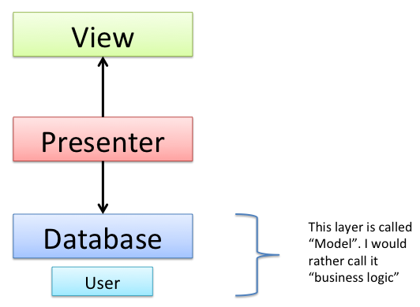
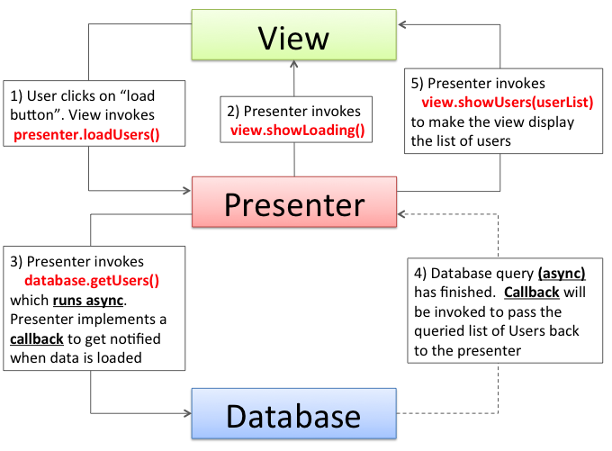

mvp
---

اگر از mvp استفاده کنیم، چه راه‌هایی برای این کار وجود دارد و بهترین راه برای ست کردن ویو در پرزنتر چیست(موقع چرخش)؟
---

ویو باید بداند که چیزها را چطور نشان دهد و نه آنکه آنها را چه زمانی نشان دهد. تنها کار ویو نمایش چیزهایی است که به او می‌گوییم. تصمیم‌گیری درباره اینکه این چیزهای کی نمایش داده‌شوند به عهده ویو نیست.

هرچه ویو پسیو‌تر باشد، بهتر است چرا که تست ui سخت است، پس باید ویو طوری باشد که به کمترین تست نیاز داشته باشد، حتی ویو نباید بگوید برو فلان اطلاعات را بیاور، باید بگوید فلان اتفاق افتاده و این پرزنتر است که تصمیم می‌گیرد براساس اتفاقات انجام شده، چه کاری را انجام دهد.

ایده‌ ۱-
ویو فقط نمایش‌دهنده - dumbView
پرزنتر فقط کنترل‌کننده ویو - بدون لاجیک و ....
پرزنترمدل فقط تولید اطلاعات می‌کند و بیزینس‌لاجیک را برعهده دارد، این اطلاعات immutable بوده و اگر چیز دیگری خواستیم دوباره به این لایه می‌گوییم تا از اول برایمان اجاد کند و بفرستد.

مدل-ویو-پرزنتر چیست و چطور استفاده کنیم؟
---
همانطور که از نامش پیداست از سه قسمت تشکیل شده است:

-مدل همان بیزینس‌لاجیکی است که داده‌ها را برای ویو فراهم می‌کند.

-ویو یک ui احمق است که باید همه کارها را به او بگوییم تا انجام دهد، دقت کنید که باید احمق باشد، اگر احمق نباشد، کار ما را سخت‌تر می‌کند.D;
  
-پرزنتر نقش واسط را بازی می‌کند، از طریق پرزنتر است که ویو و مدل با هم ارتباط برقرار می‌کنند.

mvp 
---
جریان کلی به این صورت است که کاربر باتنی لود‌کردن کشورها را در ویو کلیک می‌کند،  سپس ویو به پرزنتر می‌گوید که کلید لیست کشور‌ها کلیک شده است، سپس پرزنتر progressbar  را نشان داده  و بعد از آن به مدل می‌گوید که لیست کشور‌ها را می‌خواهم، بعد از آن مدل لیست کشور‌ها را به هرروشی که بخواهد، آماده کرده و به کال‌بک پرزنتر بازمی‌گرداند، زمانی که پرزنتر اطلاعات را از مدل گرفت، progressbar را کنسل‌کرده و به ویو می‌گوید این اطلاعاتی که آوردم را نشان بده.

قانون اصلی آن است که همه کارهای مربوط به ویو باید در ویو انجام شود و پرزنتر به هیچ‌وجه نباید از ویو حتی خبر داشته باشد. تمام کلیک‌لیستنرها، انیمیشن‌ها و ... در ویو انجام می‌شود و پرزنتر هیچ خبری از آن‌ها ندارد. شاید به ویو بگوید که مثلا فلان انیمیشن را انجام بده، اما از implementation  آن هیچ خبری ندارد.
پرزنتر باید POJO  باشد و اگر خواستیم بتوانیم از آن در یک اپلیکیشن دسکتاپ جاوایی هم استفاده کنیم.
  

برای نگه‌داشتن وضعیت‌ها، بهتر است هرکس وضعیت خودش را نگه‌دارد( Sepration of concerns). یعنی ویو وضعیت خودش را نگه داردو ... . اما نکته‌ای که اینجا وجود دارد آن است که در اپ‌های معمول همه چیز از کاربر شروع می‌شود، 

نکته: وضعیت ویو باید توسط خودش نگه‌داری شود.

در این که وضعیت‌ها را چطور هندل کنیم، دو خط فکری وجود دارد: 

۱-نگه‌داشتن پرزنتر‌ها: با singleton  کردن پرزنتر (با دگر یا هرطور دیگر) در scope  اپلیکیشن می‌توانیم، داده‌های گرفته‌شده را در پرزنتر نگه داریم و بعد از rotate از همان استفاده کنیم. اما این کار پرزنتر را پیچیده می‌کند.  

۲-نگه‌داشتن ریپازیتوری و کش‌کردن اطلاعات: در این روش ویو و پرزنتر با چرخش دوباره ساخته می‌شوند، اما ریپازیتوری در scope  اپلیکیشن singletone می‌شود و داده‌هایی که می‌گیرد را هم کش می‌کند، در این حالت هر موقع که خواستیم اطلاعات را از ابتدا از ریپازیتوری می‌گیریم، اگر ریپازیتوری اطلاعات را در کش داشته باشد،‌ آن‌ها را سریع می‌دهد ولی اگر نداشته باشد و اولین بار باشد که این اطلاعات درخواست می‌شود، آن‌ها را از اینترنت می‌گیرد و پس از کش به پرزنتر می‌دهد.

حالت دوم اوکی‌تر هست و بهتر. اما باز هم یک سوال بی‌جواب: اگر درحال دانلود یک فایل باشیم و یا هر حالت دیگری که در آن نخواهیم یک ریکوئست‌ را کنسل و دوباره بزنیم، چه باید کرد؟
---
 حالت دوم ما همیشه دوباره درخواست گرفتن داده‌ها را به ریپازیتوری می‌دهیم و از آن اطلاعات را می‌خواهیم. اگر درحال دانلود فایلی باشیم و یا هر کار دیگری، نگه داشتن وضعیت دانلود و آن کار نیمه ‌تمام به‌عهده ریپازیتوری و یا دانلودر است، و زمانی که از او دخواست می‌کنیم، باید ادامه کار را انجام دهد(لایبرری دانلودری که استفاده می‌کنیم همین کار را انجام می‌دهد).

یک چرخه که در mvp
اتفاق 
می‌افتد
---

