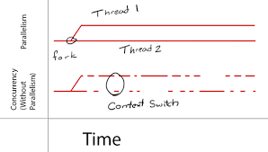

differences between Concurrency and parallelism
===

نام
===
تفاوت‌های بین  همروندی و توازی

موضوع
===
تفاوت‌های بین  همروندی و توازی

آدرس منبع
===

https://blog.golang.org/concurrency-is-not-parallelism

خلاصه
===

Concurrency = همزمانی

parallelism = همبستگی-موازات

همزمانی: یعنی بتوانیم کاری را به بخش‌های کوچکتر تقسیم کنیم و در بخش‌های کوچکتر انجام دهیم بدون آنکه در نتیجه نهایی تغییری ایجاد شود.

در برنامه‌نویسی همزمانی اجرای چند پردازش مستقل است درحالیکه همروندی اجرای همزمان و مرتبط به هم محاسبه‌هااست.

همزمانی درباره مواجه با خیلی چیزها در یک دفعه است اماتوازی درباره انجام خیلی چیزها در یک دفعه.

In programming, concurrency is the composition of independently executing processes, while parallelism is the simultaneous execution of (possibly related) computations.
Concurrency is about dealing with lots of things at once. Parallelism is about doing lots of things at once.

The programming keywords you have mentioned refer to techniques invented for specific reasons to solve problems in the field of computation and processing.

A concise essence of what each technique aims to solve:

Concurrency: There are many tasks at hand, I need a steadfast progress in each of them instead of completing one and moving on to the next in a serial approach. Let me work on each of the processes so that at a given point in time, there is non-zero progress in two or more tasks. (not necessarily in simultaneity)

Parallelism: There is potential for doing more work in unit time given my device resources. Let me use some techniques to increase throughput, possibly sacrificing latency, so that my task(s) finish quicker.

Multi-threading: Both my device hardware and software have support for more than one thread of execution in a program; Let me split the computationally intensive calculations across those processors/cores/thread-pools!

Asynchrony: A set of tasks to be completed. I am performing one of them currently. Let me call my friend to help me out with another task, I hope he/she comes back to me with the results while I continue performing my task.

Note that the techniques discussed above are not necessarily mutually exclusive. Specifically, multi-threading is a type of parallelism, which in turn does result in degree of concurrency being more than 1 (non-trivial multi-threading).

Incidentally, I've maintained a blog about parallel computing. In one of the posts, I've written about the jargon used in the same field.

نتیجه یک خطی
===
 

 
دسته‌بندی(پوشه)
===

مفاهیم

تگ
===

#concurrency 

#parallelism

#همزمانی
#توازی

نوع محتوا
===

متن