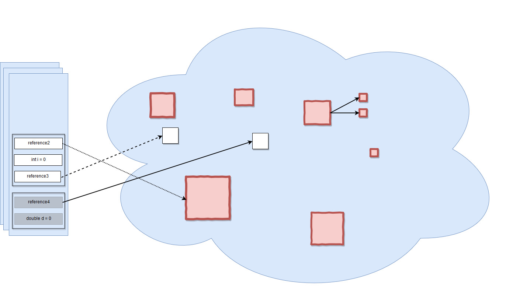
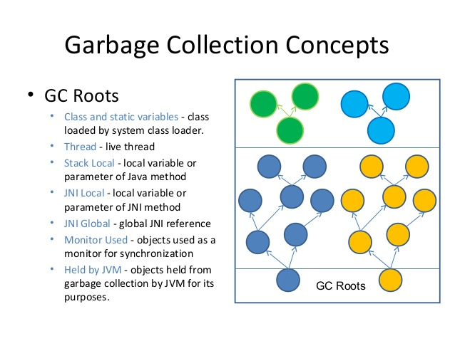

چند نوع مموری در جاوا داریم؟ هرکدام کجا، چطور و چرا استفاده می‌شوند؟
---
قسمت ران‌تایم مموری جاوا که در زمان اجرای برنامه‌ها به‌وجود می‌آید، شامل دو قسمت است: 

هیپ مموری (Heap)

استک مموری (Stack)


**هیپ مموری:**
این مموری به وسیله jre  برای ساخت آبجکت‌ها و لود شدن کلاس‌های jre  استفاده می‌شود. هر آبجکت جدیدی که ساخته شود، در این مموری قرار می‌گیرد.
سیستم gc  جاوا بر روی این مموری اجرا می‌شود، تا آبجکت‌هایی که هیچ رفرنسی به آن‌ها وجود ندارد را پاک کند.
هر آبجکتی که در این  مموری قرار دارد از همه جای‌ برنامه قابل دسترسی  است.  

نکته‌ای که درباره هیپ‌مموری مهم است آن است که هیچ ربطی به درخت هیپ ندارد و فقط نامشان یکی است، یعنی هیپ مموری از درخت هیپ استفاده نمی‌کند.

برای هر پروسه‌ای از jvm که اجرا می‌شود، فقط یک هیپ‌مموری وجود دارد.

 
**استک مموری:**
استک‌مموری برای اجرای یک ترد استفاده می‌شود.
استک‌ممور‌ی‌ها شامل مقادیر مربوط به متد‌ها (local primitive types) هستند که طول عمر کوتاهی دارند و یا رفرنسی به آبجکت‌هایی که در متدها استفاده می‌شوند. در واقع آبجکت‌ها در هیپ قرار دارند و فقط رفرنسی از آن‌ها در استک قرار دارد. 

استک مموری استکی LIFO  است.
هر زمان که متد جدیدی صدا زده می‌شود، یک بلاک جدید به بالای استک اضافه می‌شود و در دسترس آن متد قرار می‌گیرد و بعد از آنکه اجرای آن قسمت از کد به پایان برسد، آن بلاک بالای استک هم پاپ می‌شود.

اگر دقت کنید چندین استک‌مموری داریم، در واقع هرکدام از این استک‌مموری‌ها مربوط به یک ترد است و اگر ترد جدیدی ساخته شود، یک استک مموری جداگانه به ‌‌آن اختصاص داده‌می‌شود. هیچکدام از استک ممور‌ی‌ها به اطلاعات یکدیگر دسترسی ندارند اما به آبجکت‌های heap دسترسی دارند. اینجاست که ممکن‌است مشکل ConcurrentModificationError  ایجاد می‌شود.

این تکه کد را در نظر بگیرید:
```java
StringBuilder builder = new StringBuilder();
```
وظیفه کلمه‌کلیدی new آن است که مطمئن شود فضای کافی برای آبجکتی که می‌خواهیم بسازیم در هیپ وجود دارد و این فضا را به آبجکت اختصاص دهد و در نهایت رفرنسی از آن به متغیر موجود در استک‌مموری اختصاص دهد.


سایز استک‌مموری نسبت به هیپ‌مموری بسیار کمتر است.


اگر کد زیر را در نظر بگیریم:

```java
package com.journaldev.test;

public class Memory {

	public static void main(String[] args) { // Line 1
		int i=1; // Line 2
		Object obj = new Object(); // Line 3
		Memory mem = new Memory(); // Line 4
		mem.foo(obj); // Line 5
	} // Line 9

	private void foo(Object param) { // Line 6
		String str = param.toString(); //// Line 7
		System.out.println(str);
	} // Line 8

}
```  

تصویر زیر نحوه ذخیره و استفاده از آبجکت‌ها در هیپ و استک را نشان می‌دهد:


ین تصویر رفرنس ها را بهتر نشان می‌دهد:


اگر به تصویر بالا دقت کنید، می‌بینید که رفرنسی‌ها متفاوت نشان داده‌شده‌اند. این موضوع به این خاطر است که رفرنس‌های مختلف در شرایط مختلف رفتارهای متفاوتی نسبت به gc نشان می‌دهند..

این رفرنس‌ها می‌توانند:  strong, weak, soft, and phantom  باشند.


**تفاوت‌ها:**

-هیپ‌مموری توسط همه قسمت‌های اپلیکیشن استفاده می‌شود، درحالیکه استک مموری فقط توسط یک ترد استفاده می‌شود.

-هر زمان، هر آبجکتی که ساخته شود در هیپ قرار می‌گیرد و استک با رفرنس به آن دسترسی دارد. استک مموری فقط شامل  local primitive typeها و متغیر رفرنسی به آبجکت‌های موجود در هیپ‌مموری است.

-آبجکت‌های موجود در  هیپ از همه‌جا در دسترس‌اند، درحالیکه مموری استک از ترد دیگری در دسترس نیست.

-مدیریت مموری در استک LIFO   است، در صورتی که مدیریت مموری در هیپ بسیار پیچیده‌تر است چرا که به صورت global  استفاده می‌شود.

-مموری استک زندگی کوتاهی دارد، درحالیکه هیپ از ابتدای اجرای برنامه به‌وجود آمده و تا انتها وجود دارد.

- با استفاده از آپشن‌های زیر از JVM  می‌توانیم اندازه این مموری‌ها را تغییر دهیم. 
با استفاده از -Xms می‌توانیم استارتاپ سایز هیپ مموری را تغییر دهیم.
با استفاده از -Xmx می‌توانیم ماکسیمم سایز مموری را تغییر دهیم.
و با استفاده از -Xss می‌توانیم سایز استک‌مموری را تعیین کنیم.

-زمانی که استک مموری پر شود، جاوا ران‌تایم اکسپشن java.lang.StackOverFlow  را throw می‌کند. 
اما زمانی که هیپ‌مموری پر شود، اکسپشن java.lang.OutOfMemory: Java Heap Space  را throw می‌کند.

-استک مموری در مقایسه با هیپ بسیار سریع‌تر است. همچنین بسیار ساده‌تر و کم‌حجم‌تر نیز هست.


سیستم  garbage collectionجاوا چطور کار می‌کند؟
---
در جاوا و توسط jvm  پروسه‌ای در بک‌گراوند اجرا می‌شود که وظیفه آن مدیریت مموری است .
برخلاف زبان سی که مموری الوکیشن و دی‌الوکیشن توسط خود برنامه‌نویس و به صورت دستی باید انجام شود، جاوا سیستمی هوشمند برای مدیریت مموری دارد که برنامه‌نویس را از این کار معاف می‌کند.





همانطور که در عکس های بالا می‌بینید، زمانی که رفرنسی به آبجکتی نباشد، آن آبجکت برای gc تیک می‌خورد یا elligible  می‌شود و gc  می‌تواند آن را پاک کند.

اگر مقدار آبجکتی با علامت =  به null  تغییر کند آن آبجکت هم برای پاک شدن کاندید می‌شد.

این سیستم پیاده‌سازی‌ها مختلفی دارد که در این قسمت ما به دو پیاده‌سازی آن اشاره می‌کنیم.

**1-generation base**

 در این پیاده‌سازی gc  مموری را به چند قسمت فیزیکی زیر تقسیم می‌کند، قسمت young generation  زود به زود garbage collect می‌شود که به آن minor gc  می‌گویند. 

قسمت old generation جایی از مموری است که آبجکت‌هایی در آن هستند که پس از چند بار minor gc هنوز در قسمت young generation باقی مانده بودند. در این زمان این آبجکت ها به قسمت  old generation منتقل می‌شوند. هر چند مدت یکبار major gc  بررروی old generation  اجرا می‌شود تا آن را خالی کند و آبجکت‌هایی که دیگر نیازی به آن‌ها نیست را پاک کند. major gc  زمان طولانی تری برای اجرا می‌برد، برای همین با فواصل زمانی طولانی‌تری نسبت به minor gc  اجرا می‌شود. 

نحوه کار gc هم به این صورت است که یک tree  از آبجکت‌ها در مموری وجود دارد، و gc هربار این درخت را پیمایش کرده و آبجکت‌هایی که هیچ رفرنسی به آن‌ها وجود ندارد را تیک می‌زند، سپس آبجکت‌های تیک زده شده را پاک می‌کند و در مرحله آخر همه آبجکت‌های باقیمانده را به یک قسمت مموری انتقال می‌دهد، این کار باعث می‌شود که new کردن آبجکت‌های جدید با پرفورمنس بهتری انجام شود.


**2-garbage first**

در این پیاده‌سازی که در جاوا ۷ به بعد وجود دارد و قرار است در آینده جایگزین generation base gc  بشود، دیگر خبری از generation‌ها نیست. در این پیاده‌سازی heap مموری به چندین بخش مساوی به نام region تقسیم می‌شود. هر بار که gc اجرا می‌شود ابتدا بررروی regionای اجرا می‌شود که بیشترین آبجکت‌های غیرقابل استفاده را دارد و همینطور ادامه می‌دهد. برای همین به آن first gc  می‌گویند.


انواع رفرنس‌ها
---


**رفرنس‌های قوی یا Strong references:**

این رفرنس‌ها معروف‌ترین رفرنس‌هایی هستند که ما از آن‌ها بیشتر از همه استفاده می‌کنیم. 
مثال StringBuilderای که ساختیم نمونه‌ای از رفرنس‌ قوی است، این نوع از رفرنس‌ها تا زمانی که یک رفرنس‌ قوی به یک آبجکت در هیپ وجود داشته باشد، آن آبجکت gc  نخواهد شد.


**رفرنس‌های ضعیف یا Weak references:**

خلاصه این نوع از رفرنس‌ها این است که تا gc  بعدی این آبجکت را پاک کن و به صورت زیر تعریف می‌شود:

```java
WeakReference<StringBuilder> reference = new WeakReference<>(new StringBuilder());
``` 
یک مثال خوب برای استفاده از این حالت در کش‌کردن‌ها است. زمانی که یک‌سری اطلاعات را در مموری کش می‌کنیم و از این نوع رفرنس برای آن استفاده می‌کنیم، به gc می‌گوییم که می‌تواند این اطلاعات را در دوره بعدی gc  پاک کند. زمانی که دوباره این اطلاعات درخواست می‌شود، اگر gc  اجرا نشده باشد که اطلاعات هنوز وجود داشته و استفاده می‌شود، اما اگر gc  اجرا شده باشد، اطلاعات پاک شده و null  برمی‌گردد.


**رفرنس‌های نرم یا Soft references:**

این نوع از رفرنس‌ها شبیه weak referenceها هستند با این تفاوت که برای سناریو‌هایی استفاده می‌شوند که  بیشتر حساس به مموری هستند، آبجکت‌هایی با این نوع رفرنس فقط زمانی gc می‌شوند که نیاز شدیدی به مموری وجود داشته باشد و تا زمانی که jvm  نیازی به مموری ندارد این آبجکت‌ها را پاک نخواهد کرد اما به محض اینکه مموری پر شود، سریعا این آبجکت‌ها را پاک کرده تا فضای کافی ایجاد کند و برنامه به اکسپشن outOfMemory نخورد.

آبجکت‌های softReference  به صورت زیر ساخته می‌شوند:
```java
SoftReference<StringBuilder> reference = new SoftReference<>(new StringBuilder());
``` 


**رفرنس‌های روح‌مانند یا Phantom references:**

برای برنامه‌ریزی پاک‌سازی پس‌ از مرگ آبجکت‌ها و با استفاده از صفی از رفرنس‌ها پیاده می‌شود. این رفرنس برای این ایجاد می‌شود که بعد از gc مطمئن شویم که آبجکت‌هایی با این رفرنس حتما از هیپ پاک‌شده‌اند.
این رفرنس‌ها معمولا به‌جای  finilizerها استفاده می‌شوند.


استرینگ‌ها چطور رفرنس داده می‌شوند؟
---

استرینگ‌ها در جاوا immutable  هستند، یعنی بعد از آنکه ساخته‌شدند، دیگر نمی‌توانیم آ‌ن‌ها راتغییر دهیم و زمانیکه تغییر می‌دهیم یک آبجکت جدید در هیپ ساخته‌شده و مقدار در آن آبجکت جدید قرار می‌گیرد. جاوا برای بهتر کردن پرفورمنس از یک StringPool  استفاده می‌کند تا بتواند از استرینگ‌ها مجددا استفاده کند و مموری بهینه‌تر مصرف شود. 

در این حالت اگر استرینگی که مجددا استفاده می‌شود، به خانه‌ی مشترکی در مموری اشاره کند، از همان استرینگ استفاده می‌شود. البته این امر برای استرینگ‌هایی که محاسبه می‌شوند نیست. استرینگ‌هایی که محاشبه می‌شوند را با استفاده ا متد intern  می‌توان به این نوع تبدیل کرد.

```java
String localPrefix = new Integer(297).toString().intern(); //1
```  


پروسه garbage colection
---
این پروسه توسط جاوا و هر زمان که جاوا صلاح بداند اجرا می‌شود. پروسه‌ی سنگینی است و زمانی که اجرا می‌شود، تمام ترد‌ها و ... به صورت موقت pause می‌شوند. 

با استفاده از کد زیر می‌توانیم از جاوا درخواست کنیم که gc را اجرا کند. دقت کنید که با اجرای این دستور  لزوما gc  اجرا نمی‌شود، بلکه فقط از جاوا درخواست می‌کنیم که این کار را انجام دهد. البته استفاده مستفیم از این دستور پیشنهاد نمی‌شود.
```java
System.gc()
```

جاوا سه نوع gc دارد و در حالت عادی بر اساس سخت‌افزار تصمیم می گیرد که از کدام نوع استفاده کند. اما می‌توانیم نوع خاصی را نیز انتخاب کنیم که برای برنامه ما از آن مدل استفاده شود.

1. Serial GC
2. Parallel GC
3. Mostly concurrent GC
3.1. Garbage First 
3.2. Concurrent Mark Sweep  
 


چند نوع مموری در اندروید داریم؟
---

اندروید به وسیله Android Runtime (ART)  و Dalvik virtual machine ای که دارد و با استفاده از تکنیک‌های paging , memory-mapping  مموری را مدیریت می‌کند. این دو تکنیک از تکنیک‌های مدیریت مموری هستند.

تنها را آزاد کردن یک آبجکت از مموری، از بین‌بردن رفرنس آن آبجکت از برنامه است تا آبجکت برای gc آزاد شده و بتواند آن را پاک کند. اما یک استثنا هم وجود دارد و آن این است که هر فایلی که در آن بدون تغییر مموری‌مپ‌شده باشد، مثل کد‌ها، می‌تواند از مموری page out شود اگر سیستم بخواهد از آن مموری در جای دیگر استفاده کند.


گاربیج کالکتور
---
سیستم مدیریت مموری اندروید که توسط ART و Dalvik virtual machine  مدیریت می‌شود، همانند سیستم مدیریت مموری در جاوا است. 
این سیستم از روش generation-base در مدیریت مموری استفاده می‌کند و براساس معیارهایی که دارد، gc  را صدا می‌زند تا آبجکت‌های اضافی را از مموری پاک کند.

اگر gc بیشتر از حد صدا زده شود، مثلا در زمانی که با استفاده نادرست از مموری هیپ‌ را بسیار کثیف کرده‌اید، پرفورمنس برنامه پایین خواهد آمد.


برای آنکه اندروید بتواند همه کارهایی که می‌خواهد را در رم انجام دهد، تا آنجا که بتواند صفحات مموری را بین پروسه‌های اپ‌ها share  می‌کند. 

هر پروسه اپ در اندروید از پروسه‌ای موجود به نام Zygote فورک می‌شود. پروسه زیگوت به محض آنکه سیستم بوت شده و فریمورک‌های مشترک بارگذاری می‌شوند، اجرا می‌شود.
این کار به سیستم‌عامل اجازه می‌دهد که با اشتراک منابع مشترک بیشترین استفاده را از منابع و رم‌ ببرد.

برای آنکه پروسه‌ اپ جدیدی اجرا شود، پروسه‌ای از زیگوت فورک شده و سپس اپ جدید روی آن شروع به کار می‌کند.

بیشتر داده‌های استاتیک در یک پروسه مموری‌مپ می‌شوند. این کار به فریمورک اجازه می‌دهد تا اطلاعات مشترک را در یک پروسه به اشتراک گذاشته و هر موقع نیاز بود بتواند آن‌ها را در جایی دیگر مپ کند.

در بیشتر مواقع هم اندروید داینامیک‌رم یکسانی را به اشتراک می‌گذارد.
برای مثال windows surfaces از مموری اشتراکی بین اپ و screen compositor  استفاده می‌کند.


اختصاص و بازگرفتن مموری اپ
---
هیپ مموریِ دالویک، به یک مموری مجازی برای هر پروسه‌ی اپ محدود است، این سایز منطقی هیپ را مشخص می‌کند، که می‌تواند براساس نیاز بیشتر شود، اما یک سقفی دارد که توسط سیستم برای هر اپ مشخص می‌شود.
 


محدود‌کردن مموری اپ
---
برای اینکه سیستم مولتی‌تسکی مثل اندروید به درستی کار کند و به مشکل رم نخورد، اندروید محدویت‌های سختی برای کنترل مموری دارد که اگر اپ شما بیشتر از آن مقدار بخواهد از رم استفاده کند، outOfMemoryException  خواهد گرفت.

گاهی اوقات شما می‌خواهید بفهمید که چه مقدار رم برای استفاده دارید، برای اینکار از getMemoryClass()  استفاده می‌کنیم که مقدار هیپ مموری قابل استفاده را به مگابایت باز می‌گرداند.


سوییچ بین اپ‌ها
---
زمانی که کاربر یک اپ را اجرا می‌کند، پروسه‌ای برای آن اجرا می‌شود، فرض کنیم بعد از آن کاربر بین اپ سوییچ کرده و اپ دیگری را باز می‌کند، در اینجا اندروید پروسه‌ اپ قبلی را از بین نمی‌برد بلکه آن پروسه را برای استفاده سریع‌تر در دفعه‌بعدی که اپ باز می‌شود، کش ‌می‌کند. این کار باعث می‌شود که کاربر بتواند سریع‌تر بین اپ‌ها جاب‌جا شود. این کش‌کردن توسط سیستمی به نام Least recently used  یا LRU انجام می‌شود. 

اما ممکن است پروسه اپ شما توسط اندروید کیل شود، بله درست مخالف حرفی که در بالا زدیم. اگر شرایطی ایجاد شود که اندروید نیاز به مموری بیشتر داشته باشد، شروع به از‌بین بردن پروسه‌های کش شده در LRU می‌کند و این کار را براساس دو معیار انجام می‌دهد: 

۱-آخرین پروسه‌ای که اخیرا استفاده شده 

۲-پروسه‌ای که در حال استفاده نیست و بیشتری رم را اشغال کرده است.


بنابراین هرچه در حالت کش، مموری کمتری مصرف کنید، شانس زنده ماندن اپ‌تان و در نتیجه زود‌تر اجرا شدن آن در زمان بازگشت به اپ بیشتر می‌شود.


اگر در زمانی با مشکلات مربوط به رم مواجه شدیم، می‌توانیم از ابزارهایی برای پیدا کردن ریشه ان کمک بگیریم، یکی از این ابزارها
Android Profiler 
موجود در اندروید استودیو است.

همچنین با استفاده از  
dumpsys  
در کامندلاین می‌توانیم دامپ مموری را گرفته و ببینیم مشکل در کجاست

همچنین خود اندروید پروفایلر هم می تواند درخت استفاده از مموری را نشان دهد.


مموری‌لیک چیست؟ چطور اتفاق می‌افتد؟ چرا اتفاق می‌افتد؟ معمولا در کجا ها اتفاق می‌افتد؟ چه راه‌هایی برای پیدا کردن آن وجود دارد؟ چطور می‌توان آن را حل کرد؟
---


Heap size  چیست؟ چطور کار می‌کند؟ چه استفاده‌ای دارد؟ چطور استفاده می‌شود؟
---
مموری است که جاوا برای آبجکت‌ها اختصاص می‌دهد و آبجکت‌ها در هیپ‌مموری ساخته و نگه‌داری می‌شوند.  

هیپ سایز برای هر اپ توسط اندرید مشخص می‌شود، برای همین ممکن است اپ شما به مقدار هیپ‌سایز بیشتری احتیاج داشته باشد.

یکی از راه‌های برطرف کردن مشکل کمبود مموری استفاده از largeHeap
در مانیفست است.

```xml
android:largeHeap="true"
```
اما سعی کنید این کار را فقط در مواقعی انجام دهید که اپ شما واقعا نیاز به مموری بیشتری دارد.
، 
مثل اپ ادیت عکس

از این ویژگی برای برطرف‌کردن 
OutOfMemory 
استفاده نکنید، چرا که این کار باعث بزرگتر شدن هیپ‌سایز شده و در نتیجه gc زمان بیشتری برای خالی کردن آن نیاز دارد.
و در نتیجه کاربر متوجه مشکلات پرفورمنسی خواهد شد.


منابع
---

https://www.journaldev.com/4098/java-heap-space-vs-stack-memory

https://www.journaldev.com/2856/java-jvm-memory-model-memory-management-in-java

https://dzone.com/articles/java-memory-management

https://dzone.com/articles/stack-vs-heap-understanding-java-memory-allocation

https://www.yourkit.com/docs/kb/sizes.jsp


https://developer.android.com/topic/performance/memory-overview

https://developer.android.com/studio/profile/memory-profiler

https://stackoverflow.com/a/30930239/8743629


