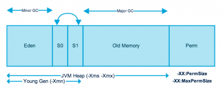

چند نوع مموری در جاوا داریم؟ هرکدام کجا، چطور و چرا استفاده می‌شوند؟
---
قسمت ران‌تایم مموری جاوا که در زمان اجرای برنامه‌ها به‌وجود می‌آید، شامل دو قسمت است: 

هیپ مموری (Heap)

استک مموری (Stack)


**هیپ مموری:**
این مموری به وسیله jre  برای ساخت آبجکت‌ها و لود شدن کلاس‌های jre  استفاده می‌شود. هر آبجکت جدیدی که ساخته شود، در این مموری قرار می‌گیرد.
سیستم gc  جاوا بر روی این مموری اجرا می‌شود، تا آبجکت‌هایی که هیچ رفرنسی به آن‌ها وجود ندارد را پاک کند.
هر آبجکتی که در این  مموری قرار دارد از همه جای‌ برنامه قابل دسترسی  است.  

نکته‌ای که درباره هیپ‌مموری مهم است آن است که هیچ ربطی به درخت هیپ ندارد و فقط نامشان یکی است، یعنی هیپ مموری از درخت هیپ استفاده نمی‌کند.

برای هر پروسه‌ای از jvm که اجرا می‌شود، فقط یک هیپ‌مموری وجود دارد.

 
**استک مموری:**
استک‌مموری برای اجرای یک ترد استفاده می‌شود.
استک‌ممور‌ی‌ها شامل مقادیر مربوط به متد‌ها (local primitive types) هستند که طول عمر کوتاهی دارند و یا رفرنسی به آبجکت‌هایی که در متدها استفاده می‌شوند. در واقع آبجکت‌ها در هیپ قرار دارند و فقط رفرنسی از آن‌ها در استک قرار دارد. 

استک مموری استکی LIFO  است.
هر زمان که متد جدیدی صدا زده می‌شود، یک بلاک جدید به بالای استک اضافه می‌شود و در دسترس آن متد قرار می‌گیرد و بعد از آنکه اجرای آن قسمت از کد به پایان برسد، آن بلاک بالای استک هم پاپ می‌شود.

اگر دقت کنید چندین استک‌مموری داریم، در واقع هرکدام از این استک‌مموری‌ها مربوط به یک ترد است و اگر ترد جدیدی ساخته شود، یک استک مموری جداگانه به ‌‌آن اختصاص داده‌می‌شود. هیچکدام از استک ممور‌ی‌ها به اطلاعات یکدیگر دسترسی ندارند اما به آبجکت‌های heap دسترسی دارند. اینجاست که ممکن‌است مشکل ConcurrentModificationError  ایجاد می‌شود.

این تکه کد را در نظر بگیرید:
```java
StringBuilder builder = new StringBuilder();
```
وظیفه کلمه‌کلیدی new آن است که مطمئن شود فضای کافی برای آبجکتی که می‌خواهیم بسازیم در هیپ وجود دارد و این فضا را به آبجکت اختصاص دهد و در نهایت رفرنسی از آن به متغیر موجود در استک‌مموری اختصاص دهد.


سایز استک‌مموری نسبت به هیپ‌مموری بسیار کمتر است.


اگر کد زیر را در نظر بگیریم:

```
package com.journaldev.test;

public class Memory {

	public static void main(String[] args) { // Line 1
		int i=1; // Line 2
		Object obj = new Object(); // Line 3
		Memory mem = new Memory(); // Line 4
		mem.foo(obj); // Line 5
	} // Line 9

	private void foo(Object param) { // Line 6
		String str = param.toString(); //// Line 7
		System.out.println(str);
	} // Line 8

}
```  

تصویر زیر نحوه ذخیره و استفاده از آبجکت‌ها در هیپ و استک را نشان می‌دهد:


**تفاوت‌ها:**

-هیپ‌مموری توسط همه قسمت‌های اپلیکیشن استفاده می‌شود، درحالیکه استک مموری فقط توسط یک ترد استفاده می‌شود.

-هر زمان، هر آبجکتی که ساخته شود در هیپ قرار می‌گیرد و استک با رفرنس به آن دسترسی دارد. استک مموری فقط شامل  local primitive typeها و متغیر رفرنسی به آبجکت‌های موجود در هیپ‌مموری است.

-آبجکت‌های موجود در  هیپ از همه‌جا در دسترس‌اند، درحالیکه مموری استک از ترد دیگری در دسترس نیست.

-مدیریت مموری در استک LIFO   است، در صورتی که مدیریت مموری در هیپ بسیار پیچیده‌تر است چرا که به صورت global  استفاده می‌شود.

-مموری استک زندگی کوتاهی دارد، درحالیکه هیپ از ابتدای اجرای برنامه به‌وجود آمده و تا انتها وجود دارد.

- با استفاده از آپشن‌های زیر از JVM  می‌توانیم اندازه این مموری‌ها را تغییر دهیم. 
با استفاده از -Xms می‌توانیم استارتاپ سایز هیپ مموری را تغییر دهیم.
با استفاده از -Xmx می‌توانیم ماکسیمم سایز مموری را تغییر دهیم.
و با استفاده از -Xss می‌توانیم سایز استک‌مموری را تعیین کنیم.

-زمانی که استک مموری پر شود، جاوا ران‌تایم اکسپشن java.lang.StackOverFlow  را throw می‌کند. 
اما زمانی که هیپ‌مموری پر شود، اکسپشن java.lang.OutOfMemory: Java Heap Space  را throw می‌کند.

-استک مموری در مقایسه با هیپ بسیار سریع‌تر است. همچنین بسیار ساده‌تر و کم‌حجم‌تر نیز هست.


سیستم  garbage collectionجاوا چطور کار می‌کند؟
---
در جاوا و توسط jvm  پروسه‌ای در بک‌گراوند اجرا می‌شود که وظیفه آن مدیریت مموری است .
برخلاف زبان سی که مموری الوکیشن و دی‌الوکیشن توسط خود برنامه‌نویس و به صورت دستی باید انجام شود، جاوا سیستمی هوشمند برای مدیریت مموری دارد که برنامه‌نویس را از این کار معاف می‌کند.


این سیستم پیاده‌سازی‌ها مختلفی دارد که در این قسمت ما به دو پیاده‌سازی آن اشاره می‌کنیم.

**1-generation base**

 در این پیاده‌سازی gc  مموری را به چند قسمت فیزیکی زیر تقسیم می‌کند، قسمت young generation  زود به زود garbage collect می‌شود که به آن minor gc  می‌گویند. 

قسمت old generation جایی از مموری است که آبجکت‌هایی در آن هستند که پس از چند بار minor gc هنوز در قسمت young generation باقی مانده بودند. در این زمان این آبجکت ها به قسمت  old generation منتقل می‌شوند. هر چند مدت یکبار major gc  بررروی old generation  اجرا می‌شود تا آن را خالی کند و آبجکت‌هایی که دیگر نیازی به آن‌ها نیست را پاک کند. major gc  زمان طولانی تری برای اجرا می‌برد، برای همین با فواصل زمانی طولانی‌تری نسبت به minor gc  اجرا می‌شود. 

نحوه کار gc هم به این صورت است که یک tree  از آبجکت‌ها در مموری وجود دارد، و gc هربار این درخت را پیمایش کرده و آبجکت‌هایی که هیچ رفرنسی به آن‌ها وجود ندارد را تیک می‌زند، سپس آبجکت‌های تیک زده شده را پاک می‌کند و در مرحله آخر همه آبجکت‌های باقیمانده را به یک قسمت مموری انتقال می‌دهد، این کار باعث می‌شود که new کردن آبجکت‌های جدید با پرفورمنس بهتری انجام شود.




**2-garbage first**

در این پیاده‌سازی که در جاوا ۷ به بعد وجود دارد و قرار است در آینده جایگزین generation base gc  بشود، دیگر خبری از generation‌ها نیست. در این پیاده‌سازی heap مموری به چندین بخش مساوی به نام region تقسیم می‌شود. هر بار که gc اجرا می‌شود ابتدا بررروی regionای اجرا می‌شود که بیشترین آبجکت‌های غیرقابل استفاده را دارد و همینطور ادامه می‌دهد. برای همین به آن first gc  می‌گویند.


---
*****برای جواب به سوالات زیر باید منابع دوم به بعد خوانده شوند.*****
---


چند نوع مموری در اندروید داریم؟
---


مموری‌لیک چیست؟ چطور اتفاق می‌افتد؟ چرا اتفاق می‌افتد؟ معمولا در کجا ها اتفاق می‌افتد؟ چه راه‌هایی برای پیدا کردن آن وجود دارد؟ چطور می‌توان آن را حل کرد؟
---


Heap size  چیست؟ چطور کار می‌کند؟ چه استفاده‌ای دارد؟ چطور استفاده می‌شود؟
---


تغییر heap size و بالابردن آن در مانیفست چه مشکلاتی را ایجاد می‌کند؟ چرا؟ چطور؟
---


منابع
---

https://www.journaldev.com/4098/java-heap-space-vs-stack-memory

https://www.journaldev.com/2856/java-jvm-memory-model-memory-management-in-java

https://dzone.com/articles/java-memory-management

https://dzone.com/articles/stack-vs-heap-understanding-java-memory-allocation

https://www.yourkit.com/docs/kb/sizes.jsp